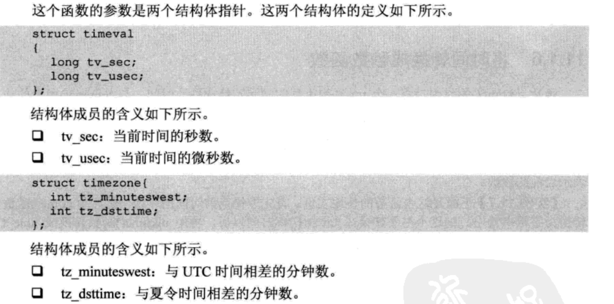

## C语言常用函数

author：贺全阳

[TOC]


### C语言常用函数

#### 字符与字符串处理

##### 大小写字母测试函数islower()和isupper()

~~~c
int islower(int c)
/*判断c是否是小写字符，如果是返回true（1），否则返回NULL（0） */
int islower(int c)
/*判断c是否是大写字符，如果是返回true（1），否则返回NULL（0） */
~~~

##### 数字测试函数isdigit()

```c
int isdigit(int c)
/* 判断参数c是否是0-9的数字 ，是数字返回真值，否则返回假值*/
```

##### 字符串转换成浮点型函数atof()

~~~c
double atof(char *nptr)
/* 参数nptr是字符串的指针，函数可以把字符串转换成一个浮点型数并返回 */
~~~

##### 字符串转换成整型函数atoi()

```c
int atoi(char *nptr)
/* 参数nptr是字符串的指针，函数可以把字符串转换成一个浮点型数并返回 */
```

##### 字符串转换成长整型函数atol()

```c
int atol(char *nptr)
/* 参数nptr是字符串的指针，函数可以把字符串转换成一个浮点型数并返回 */
```

##### 字母的大小写转换函数tolower()和toupper()

```c
int tolower(int c)
int toupper(int c)
/* 参数c代表要进行转换的字母，tolower将大写转换成小写，toupper将小写转换成大写 */
```

##### 字符串比较函数strcmp()

```c
int strcmp(const char *s1, const char *s2)
/* 比较字符串s1和s2的不同，如果相同返回0。比较过程是按照字节一个一个比较的。相减等于0继续比较，如果不等于0，返回差值 */
```

##### 比较内存内容memcmp()

```c
int memcmp(const void *s1, const void *s2, size_t n)
/* 比较指针s1和s2指向内存的前n个字节，比较方式和strcmp一样。可以比较结构体，数字，字符串等 */
```

##### 字符串复制函数strcpy()

```c
char *strcpy(char *dest, const char *src)
/* 将参数src字符串拷贝至dest，返回dest的字符串起始地址 */
```

##### 字符串复制函数strncpy()

```c
char *strncpy(char *dest, const char *src, size_t n)
/* 拷贝src所指字符串的前n个字符到dest。注意strcpy和strncpy遇到'\0'会结束拷贝 */
```

##### 内存复制函数memcpy()

```c
void *memcpy(void *dest, const void *src, size_t n)
/* 拷贝src指针所指内容的前n个字节到dest所指的内存地址上，返回指向dest的指针。和strcpy不同的是memcpy不会遇到'\0'而结束，会完整的复制n个字节，注意dest和src所指的内存区域不可重叠 */
```

##### 字符串清理函数bzero()

```c
void bzero(void *s, int n)
/* 将参数s所指的内存区域的前n个字节，全部设为零值 ，建议使用memset取代*/
```

##### 字符清理函数memset()

```c
void memset(void *s , int c, size_t n)
/* 将参数s所指的内存区域的前n个字节，全部以参数c填入 */
```

##### 字符串查找函数strchr()和strrchr()

```c
char *strchr(const char *s, int c)
/* 在字符串中查找字符第一次出现的位置，s是需要查找的字符串头指针，c是需要查找的字符,返回出现的位置，如果没查到返回NULL */
char *strrchr(const char *s, int c)
/* 在字符串中查找字符最后出现的位置，s是需要查找的字符串头指针，c是需要查找的字符，返回出现的位置，如果没查到返回NULL */
```

##### 字符串连接函数strcat()

```c
char * strcat(char * dest, const char *src)
/* 将参数src所指字符串的内容拼接到dest所指的内容中，注意dest的空间要足够，否则会出现越位的情况，导致程序出问题 */
```

##### 字符串分割函数strtok()

```c
char *strtok(char *s, const char *delim)
/* 参数s是要进行分割的字符串，delim代表分割标记字符串。返回分出来的字符串。在第一个参数第一次调用时传入s。后续调用传入NULL */
    
#include<stdio.h>
#include<stdlib.h>
#include<string.h>
int main()
{
    char *p = NULL;
    char a[20] = "qweafdffasfdsadddd";
    char s[] = "a";
    p = strtok(a,s);
    printf("%s\n",p);
    while(p=strtok(NULL,s))
    {
        printf("%s\n",p);
    }
    return 0;
}

执行结果：
         qwe
         fdff
         sfds
         dddd
         
```

##### 字符串长度函数strlen()

```c
size_t strlen(const char *s)
/* s表示字符串，返回值表示字符串长度，不包括'\0' */
```

##### 格式化函数sprintf()

```c
int sprintf(char *str, const char *format, .......)
/* 同printf类似，printf输入到屏幕上，sprintf输入到str。 */
```


#### 时间函数

##### 返回时间函数time()

```c
time_t time(time_t *t)
/* 函数time()会返回从1970年1月1日的UTC时间的0时0分0秒算起到现在所经历的秒数。参数t是个指针，如果不是空，函数会将返回值存到t指针中，如果t是空指针，函数会返回一个time_t型的长整型数 */
```

##### 取当时时间函数gmtime()

```c
struct tm *gmtime(time_t *timep)
/* 将time_t类型指针指向的秒数，转换成日常可以理解的时间，并存入结构体中，结构体详细信息自行百度，注意此处转化的时间是UTC的时间 */
```

##### 取当时时间函数localtime()

```c
struct tm *localtime(time_t *timep)
/* 将time_t类型指针指向的秒数，转换成日常可以理解的时间，并存入结构体中，结构体详细信息自行百度，gmtime()函数转化的时间是UTC的时间，localtime()转换成本地时区的时间 */
```


##### 字符串格式时间函数ctime()和asctime()

```c
char *ctime(time_t *timep)
/* 将time_t类型指针指向的秒数(参考time()函数)，转换为本地时区的时间，与计算机上显示的时间相同，返回的字符串格式如下：Feb Jun 14 12:56:08 1999 */
char *asctime(struct tm *timeptr)
/*  将struct tm类型指针指向的结构体(参考gmtime()函数)，转换为本地时区的时间，与计算机上显示的时间相同，返回的字符串格式如下：Feb Jun 14 12:56:08 1999 */
```

##### 将时间转换成秒数函数mktime()

```c
time_t mktime(struct tm * timeptr)
/* 将tm结构体转换成秒数，和gmtime功能相反 */
```

##### 取得当前时间函数gettimeofday()

```c
int gettimeofday(struct timeval *tv, struct timezone *tz)
/* 此函数能获得微秒级的精度，函数会把当时时间的参数返回给tv和tv两个结构体指针上，如果出来成功返回真值1，否则返回0 */
```



##### 设置当前时间函数settimeofday()

~~~c
int settimeofday(struct timeval *tv, struct timezone *tz)
/* 需要root权限才能操作，详细信息参考gettimeofday()函数 */
~~~

#### 文件操作

##### 打开文件fopen()

```c
FILE *fopen(const char *path, const char *mode)
/* 参数path代表文件路径及文件名，mode代表流形态
mode有下列几种形态字符串：
	r打开只读文件，改文件必须存在。
	r+打开可读写文件，该文件必须存在
	w打开只写文件，若文件存在则文件长度清0，文件内容清空。不存在则建立文件
	w+打开可读写文件，若文件存在则文件长度清0，文件内容清空。不存在则建立文件
	a以附加的方式打开只写文件，若文件不存在则建立文件,写入的数据追加到文件尾
	a+以附加的方式打开可读写文件，若文件不存在则建立文件,写入的数据追加到文件尾
	其他自行百度
*/
```

##### 关闭文件fclose()

```c
int fclose(FILE *stream)
/* 关闭打开的文件，stream为fopen打开的文件指针 */
```

##### 读取文件内容函数fgets()

```c
char *fgets(char *s, int size, FILE *stream)
/* 从stream所指的文件内读取字符并存入到s所指的空间，直到出现换行符或者读取size-1个字符，最后会加上NULL作为字符串结束 */
```

##### 格式化输入文件fprintf()

```c
int fprintf(FILE *stream, const char *format, .......)
/* 和printf类似，printf输入到屏幕上，fprintf输入到stream对应的文件中 */
```

#### 公司自有函数

##### 去左右两边空格函数strtrim()

```c
char *strtrim(char *str)
/* str为需要去空格的字符串 */
```

##### 应用日志函数APPLOG()

```C
APPLOG是宏定义的，具体实现不做介绍。
使用方法 APPLOG("D","%s",test),第一个参数代表日志级别，"D","I","N","W","E","F"级别依次递增。
通常只使用"D"debug，和"E"ERROR,级别。正常日志D，报错使用E级别，比printf多一个参数，其他和printf一样，具有可变参数的性质。
```

##### 分割函数SubSignString()

```c
int SubSignString(int num, char sign, char *buf, char *tag)
/* num代表获取第几个分隔符前面的字符串，sign代表分割符，buf需要进行分割的字符串，tag分割出的字符串 */
```

#### 总线数据获取及设置

获取总线数据get_zd_data/double/long

```c
char  *get_zd_data(char *, char *)
long get_zd_long(char *, long *) 
double get_zd_double(char *, double *)
/* get_zd_data("0300",test)  将总线0300中的数据存入test所指的内存中，其他函数用法一样。 */
```

##### 设置总线数据set_zd_data/double/long

```c
char  *set_zd_data(char *, char *)
long set_zd_long(char *, long ) 
double set_zd_double(char *, double )
/* set_zd_data("0300",test)  将test中的数据存入总线0300中，其他函数用法一样。 */
```

#### 公司表操作函数

##### 表更新函数Dec/Fet/Upd_Upd

~~~c
表名以大写开头
int 表名_Dec_Upd(char *reply, char *fmtstr, ...)
/* 申明游标，reply是返回信息代码，后面参数使用方式参考printf，使用方式一样。代表的内容是sql语句where查询条件后面的内容如：a='111' and b='222'。使用可变参数拼接查询条件 */
int 表名_Fet_Upd(表结构体指针, char *reply)
/* 根据where拼接的条件，查询数据。并将查询的一条数据存入表结构体指针所指的内存中。每次调用此函数返回下一条数据存入指针所指的内存中，根据返回值判断是否查询到数据，返回0代表查询到数据，返回100代表没有查询到数据，返回其他值代表出错。 */
int 表名_Upd_Upd( 表结构体 , char *reply )
/* 修改Fet_Upd返回存入结构体中的数据，将结构体传入此函数，可以将修改的数据更新到表中 */
int 表名_Clo_Upd()
/* 关闭修改游标 */
~~~

##### 表插入函数Ins

```c
int 表名_Ins(表结构体 , char *reply)
/* 插入数据到表中，返回0代表插入成功。 */
```

表批量查询函数Dec/Fet

```c
int 表名_Dec_Sel(char *reply, char *fmtstr, ...)
/* 申明游标，reply是返回信息代码，后面参数使用方式参考printf，使用方式一样。代表的内容是sql语句where查询条件后面的内容如：a='111' and b='222'。使用可变参数拼接查询条件 */
int 表名_Fet_Sel(表结构体指针, char *reply)
/* 根据where拼接的条件，查询数据。并将查询的一条数据存入表结构体指针所指的内存中。每次调用此函数返回下一条数据存入指针所指的内存中，根据返回值判断是否查询到数据，返回0代表查询到数据，返回100代表没有查询到数据，返回其他值代表出错。 */
```

表单笔查询Sel

~~~c
int 表名_Sel(char *reply, 表结构体指针, char *fmtstr, ...)
/* 此函数是批量查询的结合体，包含 int 表名_Dec_Sel(char *reply, char *fmtstr, ...)，int 表名_Fet_Sel(表结构体指针, char *reply)两个函数，但是只调用了一回Fet函数，所以只会查询一次。*/
~~~


Epcc_bsiparm_Sel(char *reply, struct epcc_bsiparm_c *epcc_bsiparm_c, char *fmtstr, ...)

表名_Dec_Upd(char *reply, char *fmtstr, ...)

