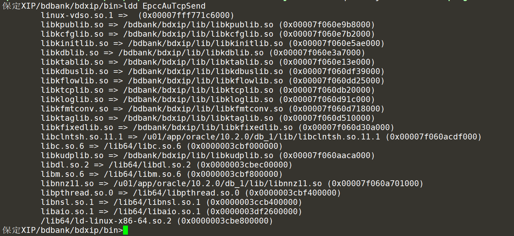

## C语言程序的基本原理

author：贺全阳

[TOC]

### linux下c程序

linux下的c与在window下的c编程无本质差别，基本都一样。linux下编程需要依赖linux命令，学会linux下基本命令和vim的使用尤为重要。

### 编译器gcc

linux下c程序的编译，不管编译成动态库还是可执行程序都需要通过gcc进行编译。gcc在编译过程会校验程序语法，如果语法有问题会报错。

 gcc是开放源代码领域使用最广泛的编译器，功能强大，支持性能优化。目前gcc可以用来编译才C/C++,JAVA等多种语言，使用广泛。

 -o  指定生成的输出文件 

 -E 仅执行编译预处理

 -S 将C代码转化为汇编代码

 -c 仅执行编译操作，不进行连接

  gcc的编译分为四个部分：

1. 编译预处理（展开头文件，展开宏，生成.i文件），如：gcc -E test.c -o test.i
2. 编译阶段（进行语法规范性的检查，并编译成汇编语言，生产 .s文件），如：gcc -S test.i -o test.s
3. 汇编阶段（转化为二进制目标代码），如：gcc -c test.s -o test.o
4. 链接阶段（将汇编生成的机器码汇集成一个可执行的二进制代码文件），如：gcc test.o -o test

当然也可以一步编译成可执行程序，如：gcc test.c -o test

### 可执行程序和库文件的编译

1. 可执行文件：

- 什么是可执行文件？

​	可执行程序就是已经经过编译和连接转化成二进制代码了,计算机能识别，在window下当用户直接双击(其实就是发出命令给操作系统,由操作系统来响应)之后,操作系统会调用main函数开始执行,WINDOWS是以.EXE作为扩展名的表示是可执行文件，linux下c编译出的可执行文件不带后缀。

- 可执行文件如何编译？

​	通过gcc编译c程序生成可执行文件，如：gcc test.c -o test，test就是一个可执行文件。在可执行程序的当前目录执行"./test"命令，相当于window下双击exe。

- 可执行文件调用动态库中的程序如何编译？

​	如test.c程序中调用了libacs.so动态库中的"str()"程序，那么编译test.c时需要链接动态库。如：gcc test.c -o test -L/jzxip/lib -lacs。  -L参数指定的是链接时libasc.so的路径地址，libasc.so在哪的实际地址。-l指定链接哪个动态库，可以省略lib开头。如果存在调用了多个动态库中的程序，按照libasc.so的链接方式进行链接。

2. so动态库：

- 什么是库文件？

c库在文件机构上和可执行程序相差不大，可执行程序有执行入口，库文件没用。c库文件分两种，一种是静态库以“.a”结尾，另一种是“.so”结尾的动态库。如果链接的是静态库，在编译的时候被调用的程序被编译进可执行程序中。这种方式优点是执行速度快，但缺点也很明显，如果静态库变更了，可执行程序想要变更的话必须重新编译。如果链接的是动态库，在编译时不会将代码编译进可执行程序中。当可执行程序执行的时候动态调用库文件，这种链接方式特别灵活，当动态库发生变更时不需要重新编译，并且动态库可以共享，如果多个可执行程序都调用了同一个动态库，那么内存中只会存在一份动态库加载文件，节约了内存空间。但是因为是执行时调用动态库，涉及动态库符号信息等加载解析，这样速度上比静态库的方式慢。（库的链接加载涉及比较多的内容，这里只是比较浅显的说明，要想深入理解可以百度。推荐书籍《程序员的自我修养》）

- 库文件如何编译

  通过gcc编译c程序生成库文件，如str.c程序，gcc -fPIC -shared str.c -o libasc.so。-shared代表生成可共享的动态库，-fPIC代表生成与地址无关的代码。编译成静态库，gcc  -c str.c，ar -rv libasc.a str.o。分为两个命令。另外动态库也可以链接其他动态库，链接方式同可执行方式一样。但是在符号检查上没用可执行程序严格。

### 程序运行与so调用

动态库是程序运行时才会调用，我们可以通过ldd查看调用了哪些库，库文件地址，库文件在可执行程序中的地址。程序运行的时候会根据对应地址查找动态库。如果出现地址not found的情况代表动态库不在ld查找so的地址中，执行的时候也会报错，注意这个地址与编译时指定的地址无关联。ld只会去相关路径下查找so，编译时不管so在哪，通过-L参数可以查找。如下：

