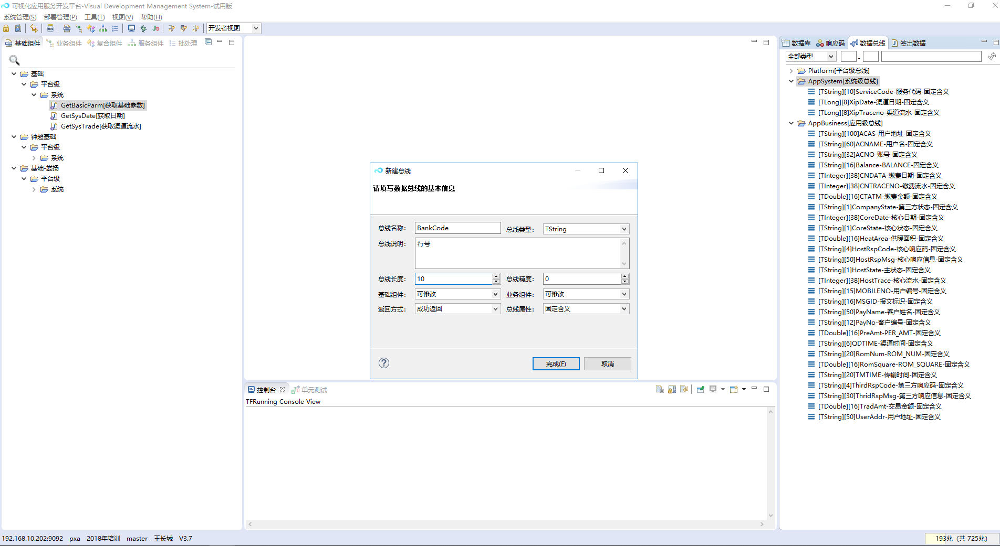
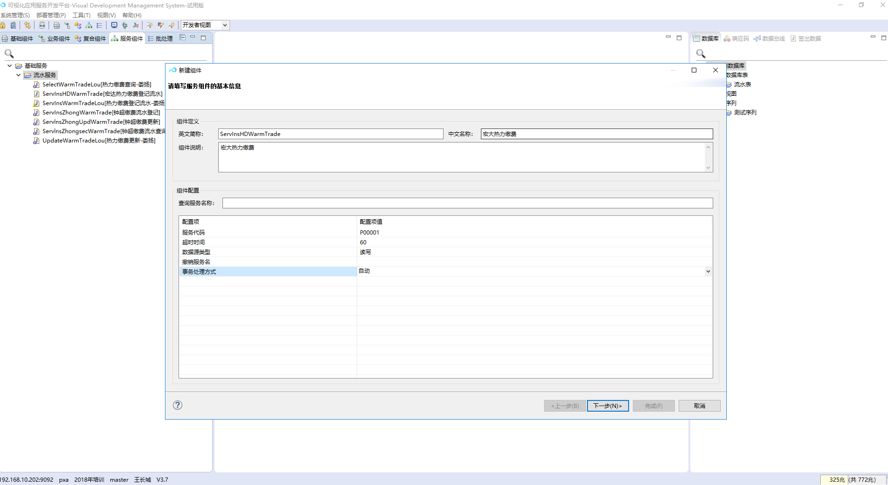

# 一、VDM整体介绍

## 1、工具获取

在浏览器中输入ftp://192.168.10.202,下载vdmtool.zip。（也可以通过其他工具下载） 

## 2、简介

VDM是公司自主研发的后台开发工具。可以进行系统程序编写及调用。 

## 3、界面布局

VDM主要分成三个区域

### 1）目录区域

开发文件名称详细展示区域，主要包括基础组件、业务组件、复合组件、服务组件、批处理。 

### 2）工作区域

程序开发及程序流程配置区域。

### 3）参数区域

开发辅助参数配置区域，主要包括数据库、响应码、数据总线、签出数据等窗口。 

另外，系统还包括最上端的包括辅助功能，包括系统管理、部署管理、工具、视图、帮助等。 

# 二、开发举例（缴费登记）

## 1、整体流程

配置数据源->配置数据库->配置响应码->配置数据总线->编写基础组件->编写业务组件->编写服务组件。

## 2、详细说明

### 1）配置数据源

#### a、打开窗口

点击窗口顶端菜单栏选择工具菜单，在下拉菜单选项中选择数据源管理，之后选择新建数据源，如果已有数据源则选择修改数据源。

#### b、新增数据源

在数据源简称填写需要增加数据源的名字，在数据源说明中填写相关说明，数据库类型选择需要连接的数据库种类（可选数据库ORACLE、INFORMIX、DB2、MYSQL），数据库模板和数据源状态选择默认，点击下一步。

新窗口中username、password填写连接数据库的用户名密码，url添加连接数据库的连接地址（包括IP、端口、实例名），其他的默认填写，点击保存。

#### c、修改数据源

修改数据源于新增数据源配置内容相同，参考新增数据源。

#### d、查看数据源

查看数据源可查看配置的数据源内容以及删除数据源。

### 2）配置数据库

#### a、新建数据库

在右侧数据库窗口右键新建数据库，填写数据库名称（只能英文），填写数据库说明，数据库分类选择数据库类型，其他默认保存，新增修改配置内容相同。点击保存默认生成数据库表、视图、序列子文件夹。

#### b、新建子文件夹

在右侧数据库子文件夹上右键选择新建分类。

填写分类简称及分类说明，并保存。修改同新增。

#### c、新建表

在右侧子文件夹下右键选择新建数据库表。修改同新增。

基本信息。填写表名、表中文名称、说明。MAC校验可选择是/否，选择是就是控制不能进行手工改表，选择否就是不控制，默认填否。动态表可选择非动态表/动态表，默认选择非动态表。

字段信息。填写字段名、长度、精度、描述。类型根据字段类型进行选择，字符型选Char，整型选Integer，浮点型选Double，文本大数据选Clob，日期型选Date，二进制大数据选Blob。参加MAC校验可选择是或否，是就是该字段参与MAC校验。有默认值可选择是或否，选择是则需填默认值。

右侧有添加字段等按钮，点击添加字段可添加一行空白字段，复制字段则复制一条已选中字段，删除字段则删除选中字段。选择一条字段可选择移到顶部、上移、下移、移到底部。

主键信息。填写主键名称及主键说明。将作为主键的字段点击右移按钮。右侧的主键区可选择一个字段进行上移或下移操作调整主键字段顺序。

索引信息。点击'+'号添加索引，填写索引名称和索引说明。索引类型可选择唯一索引或非唯一索引。默认主键为唯一索引。一般情况不需要添加索引。

约束信息。点击'+'号添加约束，填写约束名称和约束说明。约束内容中选择约束字段，选择约束行为，可选择大于、小于、等于、不等于、大于等于、小于等于、在枚举值中、不在枚举值中、在范围内、在范围外等。填写约束值。可选择AND、OR连接约束条件。一般情况不需要添加约束。

填写完成后点击保存按钮保存数据库表信息。

#### d、新建序列

在右侧子文件下右键新建序列。修改同新增。

填写英文简称、中文名称、序列说明、建表语句，并保存。

### 3）配置响应码

#### a、新建分类

在右侧响应码窗口右键新建分类。修改分类同新建分类流程。

填写分类名称、分类说明并保存。

#### b、新建响应码

在分类文件夹右键选择新建响应码。

填写响应码名称及响应码信息。响应码信息支持使用'{0}'、'{1}'占位符。

### 4）配置数据总线

#### a、新建总线

在右侧响应码窗口右键新建总线。修改总线同新建总线流程。总线可分成平台级总线、系统级总线、应用级总线。平台级总线不允许新增、修改操作。

填写总线名称、总线长度、总线精度。总线类型根据传递的总线中了填写，字符型选TString，密码型选TPassword，布尔型选TBoolean、短整型选TShort、整型选TInteger、长整型选TLong、单精度浮点型选TFloat、双精度浮点型选TDouble、金额型选TBigDecimal、日期型选TDate、长日期型选TLongDate、数组型选TDataTable。基础组件、业务组件可选择可修改或不可修改，选择不可修改则不能基础组件、业务组件改变总线的值。返回方式可选择成功返回、必须返回、不返回。总线属性可选择固定含义、非固定含义。

### 5）编写基础组件

#### a、新建分类

在左侧基础组件窗口右键新建分类。修改分类同新建分类流程。

填写分类简称及分类说明并保存。

#### b、新建组件

在分类上右键点击新建组件

填写英文简称、中文名称、组件说明，选择关联的表并点击下一步。

选择关联的基础组件，并点击保存。

#### c、编写程序

基础组件可以自定义格式，通常基础组件程序为一些公共处理日期、字符串程序。

	public class GetSysDate {
		public String getSimpleDate() {
			SimpleDateFormat df = new SimpleDateFormat("yyyyMMdd");
			return df.format(new Date());
		}
	}
### 6）编写业务组件

#### a、新建分类

在左侧业务组件窗口右键新建分类。修改分类同新建分类流程。

填写分类简称及分类说明并保存。

#### b、新建组件

在分类上右键点击新建组件

填写英文简称、中文名称、组件代码、组件说明，组件代码为该业务组件的唯一标识。选择关联的表并点击下一步。

选择关联的基础组件，并点击下一步。

选择需要传入参数的数据总线，系统总线不用选择，自动入参。选好点击下一步。

选择需要传出的参数的数据总线。选好点击完成。

#### c、编写程序

	public class BusInsHDWarmTrade implements SubService {
		Logger logger = null;
		DasSubServiceResponse response = new DasSubServiceResponse();
	
		@Override
		public DasSubServiceResponse doInvoke(DasSubServiceContext context, DasSubServiceRequest request) {
		
			logger = DasLoggerFactory.getLogger(BusInsHDWarmTrade.class, context.getLogId());		
			Long xipDate = request.getLong(AppSystem.XipDate);
			Long xipTraceno = request.getLong(AppSystem.XipTraceno);
			String payNo = request.getString(AppBusiness.PayNo);
			String payName = request.getString(AppBusiness.PayName);
			String romNum = request.getString(AppBusiness.RomNum);
			String userAddr = request.getString(AppBusiness.UserAddr);
			BigDecimal romSquare = request.getBigDecimal(AppBusiness.RomSquare);
			BigDecimal perAmt = request.getBigDecimal(AppBusiness.PreAmt);
			BigDecimal tradAmt = request.getBigDecimal(AppBusiness.TradAmt);
			BigDecimal balance = request.getBigDecimal(AppBusiness.Balance);
		
			PxfzHdwarmTrace pxfzHdwarmTrace = new PxfzHdwarmTrace();
			pxfzHdwarmTrace.setXipDate(xipDate);
			pxfzHdwarmTrace.setXipTraceno(xipTraceno);
			pxfzHdwarmTrace.setPayNo(payNo);
			pxfzHdwarmTrace.setPayName(payName);
			pxfzHdwarmTrace.setRomNum(romNum);
			pxfzHdwarmTrace.setUserAddr(userAddr);
			pxfzHdwarmTrace.setRomSquare(romSquare);
			pxfzHdwarmTrace.setPerAmt(perAmt);
			pxfzHdwarmTrace.setTradAmt(tradAmt);
			pxfzHdwarmTrace.setBalance(balance);
		
			context.insert(pxfzHdwarmTrace);
		
			return response.setRetMsg("0000");
		}
	}
### 7）编写服务组件

#### a、新建分类

在左侧服务组件窗口右键新建分类。修改分类同新建分类流程。

填写分类简称及分类说明，接口类型、实现类型、流程类型默认选择并点击下一步。

默认选择并点击完成。

#### b、新建组件

在分类上右键点击新建组件

填写英文简称、中文名称、组件说明及服务代码，服务代码可以理解为内部交易码。超时时间为运行该组件的最大时间，默认即可。数据源类型根据业务场景可选择只读、只写、读写。事务处理方式可选择人工或自动。其他默认并点击下一步。

选择需要传入参数的数据总线，系统总线不用选择，自动入参，可空类型可选择必须输入、可选输入、条件输入。选好点击下一步。

选择需要传出的参数的数据总线。返回标志可选择必须返回、不返回、成功返回，可空类型可选择必须输出、可选输出、条件输出选好点击完成。

#### c、配置流程

在中间区域拖动开始和结束图标作为流程开始和结束，直接打开业务组件窗口，将业务组件拖动到中间区域。点击连接线图标将流程连接起来并保存。

其他组件说明：

条件图标：按照条件去执行业务组件。

分支图标：按照条件分支执行业务组件。

循环图标：按照一定条件循环执行业务组件。

终止图标：按照条件终止循环执行。

继续图标：按照条件终止此次循环并继续下次循环。

成功图标：判断成功执行业务组件。

失败图标：判断失败执行业务组件。

未知图标：判断结果未知执行业务组件。

通信图标：与外部系统进行通信的业务组件。

提交图标：当事务处理模式为人工，拖动此图标可选择提交事务。

回滚图标：当事务处理模式为人工，拖动此图标可选择回滚事务。