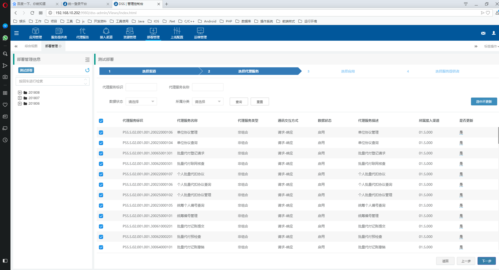

#  一、Dss整体介绍

## 1、登录页面

在浏览器输入http://192.168.10.202:9980/vom-kite/Views/login.html，输入用户名密码。点击登录图标

选择分布式服务交换平台（DSS）即可访问。

## 2、系统简介

Dss是公司自主研发的一套配置通讯服务及报文转换的业务处理平台。

配置从左到右。

- 应用管理：配置服务发布方应用。
- 服务提供者：配置服务发布方发布的应用接口及报文。
- 代理服务：配置服务调用方代理服务。
- 接入渠道：配置服务调用方应用接口及报文。
- 资源管理：查看配置连接器、转换器等
- 部署管理：将配置好的应用管理、服务提供者、代理服务、接入渠道打包成更新包。
- 上线配置：将更新包更新部署。
- 运维管理：查看维护应用服务。

# 二、开发配置

## 1、整体流程

配置应用管理->配置服务提供者->配置代理服务->配置接入渠道->配置部署管理->配置上线配置->配置运维管理。

## 2、详细说明

### 1）配置应用管理

#### a、添加应用

点击上端应用管理图标。

点击左侧添加应用。在已有的应用上点修改图标可修改应用，新增和修改要素一致。

填写应用标识、应用英文名称、应用中文名称，应用标识为Dss统一分配。应用类型可选择客户管理层、产品服务层、基础服务层、管理分析层、行外系统层，只是对应用类别进行划分，没有实际意义，可默认选产品服务层。接入类型可选标准接入、适配接入，默认选适配接入。选择连接器可选DAS连接器、HTTP连接器、TCP连接器，与提供服务的应用系统通讯方式有关。选择转换器可选DAS2DSS转换器、分隔符转换器、DSS2DAS转换器、固定格式转换器、标准8583转换器、JSON转换器、XML转换器，转换器与服务提供的报文格式有关。数据状态默认启动。

连接器配置中连接地址列表填写连接应用IP、端口。接入类型与之前配置一致。字符集根据目标系统字符编码填写，如utf-8。解码器、编码器、协议、版本号默认填写。

转换器配置中，接入类型与之前配置一致。响应码是否转换可配置是或否，是就是Dss与目标系统需要对响应码进行转换。填写默认失败响应码、成功响应码、超时响应码，响应码长度以及响应码所在域标签。点击提交。

#### b、编辑模板

在已配置完应用服务右侧点击编辑模板可配置报文模板，服务提供者中的报文接口配置可自动继承模板配置。

点击添加节点，右侧填写节点名称、节点别名、节点描述。处理模式可选不处理、常量、数据总线、系统总线、数据表格，不处理表示不做任何处理，常量表示固定值，数据总线、系统总线表示总线传递，数据表格表示数组。数据处理表示对传递数据进行处理，可选增加小数点、明细长度转为明细笔数、左补零、删除小数点。是否必填可选是或否。点击保存则保存节点。点击提交则提交模板。

### 2）配置服务提供者

#### a、新建分类

点击上端服务提供者图标。点击左侧新建分类。

选择所属应用，填写分类标识、分类名称、分类描述。建立多层级分类可在左侧树状菜单中点击'+'号图标。修改与新增要素一致。

#### b、新增服务

在左侧树状菜单对应分类右侧点击'√'号图标，新增服务。

基本信息中，填写服务发布标识、原应用标识、服务提供者标识、服务调用接口、超时时间、数据状态、服务描述。服务发布标识按照Dss生成规则统一命名，服务提供者标识与服务发布标识一致。负载均衡方式可选随机、加权随机、轮询、加权轮询，根据·情况选择，默认选择随机。请求交互方式可选择单项调用、请求-响应、异步请求，一般默认选择请求-响应。点击下一步。

服务请求配置。点击添加节点，节点名称、节点别名、节点描述、处理模式、数据处理、是否必填同编辑模板。数据类型可选择字符串、大整型、大数值对象、密码型、布尔型、短整型、整型、单精度浮点型、双精度浮点型、日期型、长日期型。数据长度可填写长度及精度。点击保存则保存节点。填写完成点击下一步。

服务响应配置规则同服务请求配置，填写完成点击提交。

### 3）配置代理服务

#### a、新建分类

点击上端代理服务图标。点击左侧新建分类。

填写分类标识、分类名称、分类描述。建立多层级分类可在左侧树状菜单中点击'+'号图标。修改与新增要素一致。

#### b、新增代理服务

在左侧树状菜单对应分类右侧点击'√'号图标，新增代理服务。修改同新增。

基本信息中，填写代理服务标识、代理服务名称、超时时间、代理服务描述。代理服务标识按照Dss生成规则统一命名，通讯交互方式可选择单项调用、请求-响应、异步请求，一般默认选择请求-响应。代理服务模型选择非组合，在弹出层选择关联的服务提供者。数据状态默认启动。点击下一步。

指令类型选择路由定义，指令内容默认选择服务提供者。点击提交。

### 4）配置接入渠道

#### a、添加接入渠道

点击上端接入渠道图标。点击左侧添加接入渠道。修改同新增。

填写渠道标识、渠道名称、渠道描述。渠道标识按照Dss生成规则统一命名。接入类型默认选择适配接入。选择监听器可选DAS监听器、HTTP监听器、TCP监听器，与接入渠道的应用系统通讯方式有关。选择转换器可选DAS2DSS转换器、分隔符转换器、DSS2DAS转换器、固定格式转换器、标准8583转换器、JSON转换器、XML转换器，转换器与接入渠道的报文格式有关。选择错误处理可选择DAS错误处理、公共错误处理。数据状态默认启动。

监听器配置中接入类型与之前配置一致。监听IP填写接入渠道应用IP、监听端口填写截取渠道应用端口。报文最大长度根据实际情况填写，字符集根据接入渠道字符编码填写，如utf-8。版本号、协议默认填写。

转换器配置中，接入类型与之前配置一致。响应码是否转换可配置是或否，是就是Dss与接入渠道需要对响应码进行转换。填写默认错误码、响应码长度、成功响应码、未知响应码，以及交易码路径、响应码所在域标签，其他默认。

错误处理中，接入类型与之前配置一致。报文内容填写错误处理返回报文。

#### b、新建分类

在左侧配置好的接入渠道点击'+'号图标。填写分类标识、分类名称、分类描述。修改与新增要素一致。

#### c、关联代理服务

在左侧配置好的接入渠道点击'√'号图标。

在基本信息中，点击关联代理服务输入框，弹出层选择关联代理服务。数据状态默认启用。在场景映射中填入接入渠道的交易码，填入后可将外部交易码转换成内部交易码。在属性信息中填入属性信息。

在服务请求配置中，点击左侧可添加节点。节点名称、节点别名、节点描述、处理模式、数据类型、数据长度、数据处理、是否必填同服务提供者服务请求配置。节点类型可选择管理、数组、叶子，根据报文节点选择。数据内容根据总线选择。右侧会显示总线映射情况。点击保存则保存节点。填写完成点击下一步。

服务响应配置规则同服务请求配置，填写完成点击提交。

### 5）配置部署管理

点击测试部署。选择渠道中选择要部署的渠道，填写部署说明。点击下一步。

选择代理服务。选择需要部署的关联的代理服务。点击下一步。

选择应用。选择需要部署的关联的应用。点击下一步。

选择服务提供者。点击提交，会弹出文件选择器选择更新包存放路径，保存后生成更新包。

### 6）配置上线配置

点击上线部署。部署文件中选择要部署的文件，点击开始上传。上传成功后点击下一步。

在接入渠道中，填写部署说明。选择下一步。

在代理服务中，默认选择下一步。

在应用管理中，默认选择下一步。

在服务提供者中，默认选择提交。

### 7）配置上线配置

在运维管理中，点击左侧接入渠道，显示所有接入渠道的信息。可选择批量启动、批量停止、启动、停止接入渠道的服务。

