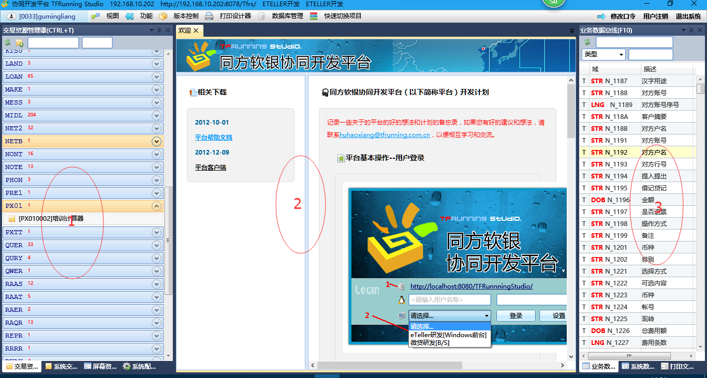
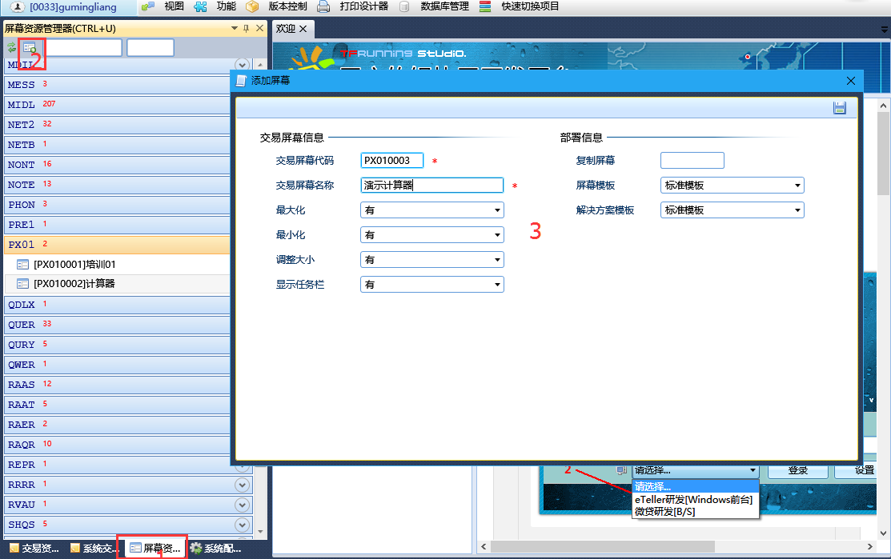
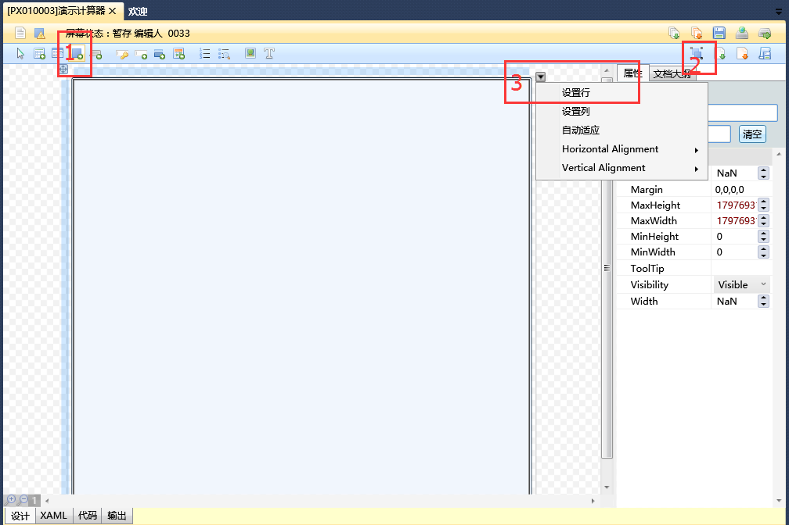
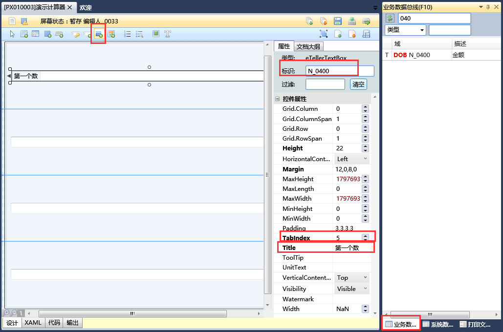
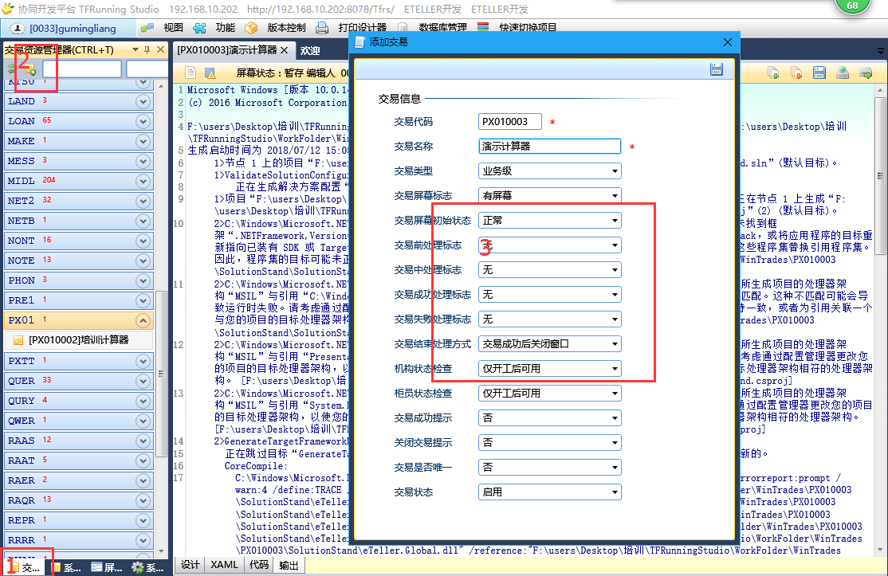
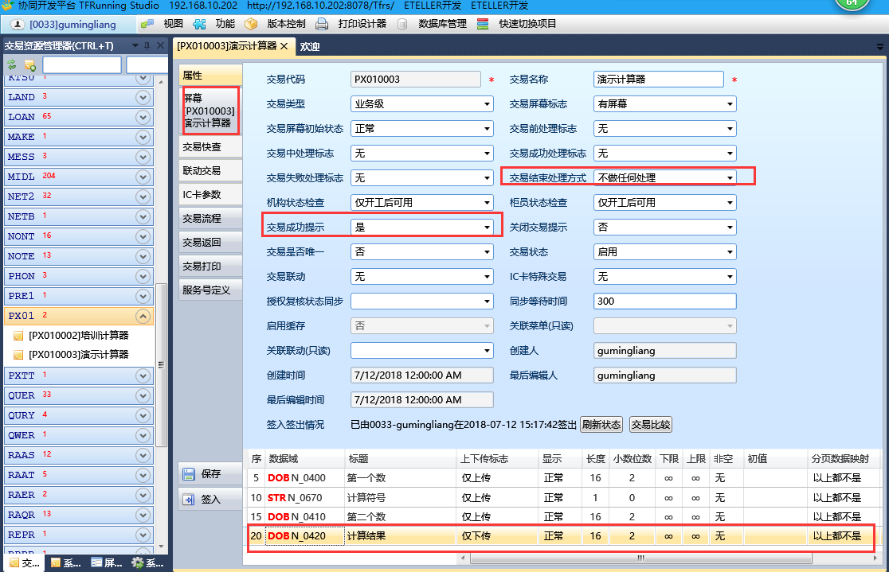
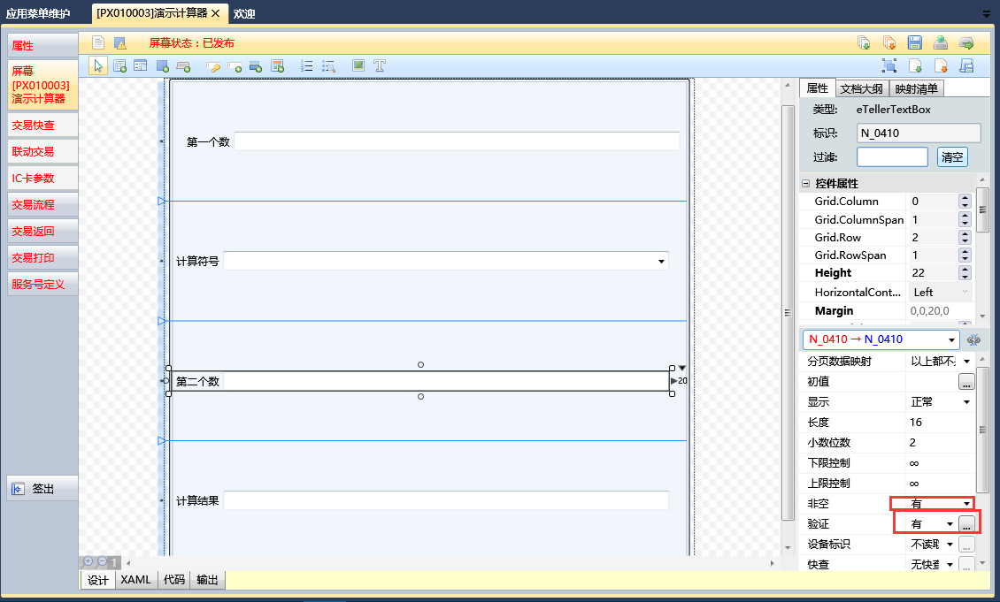
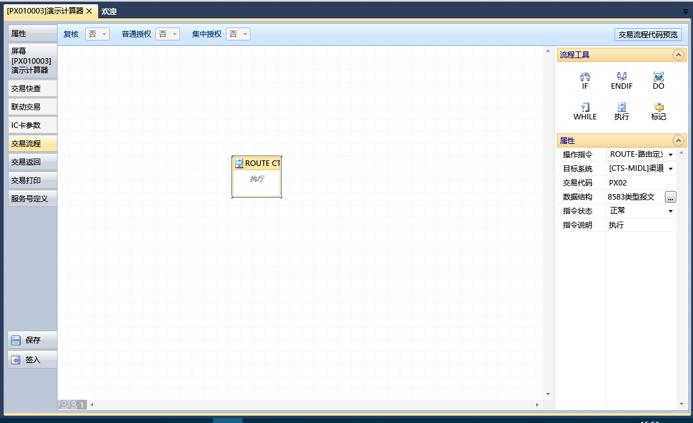
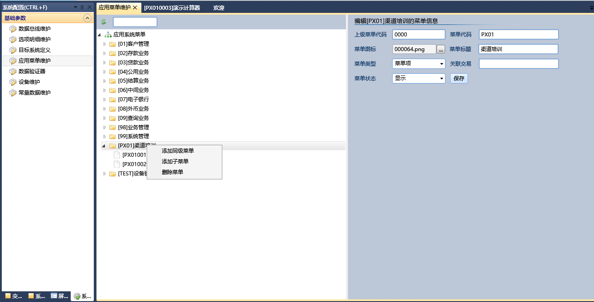
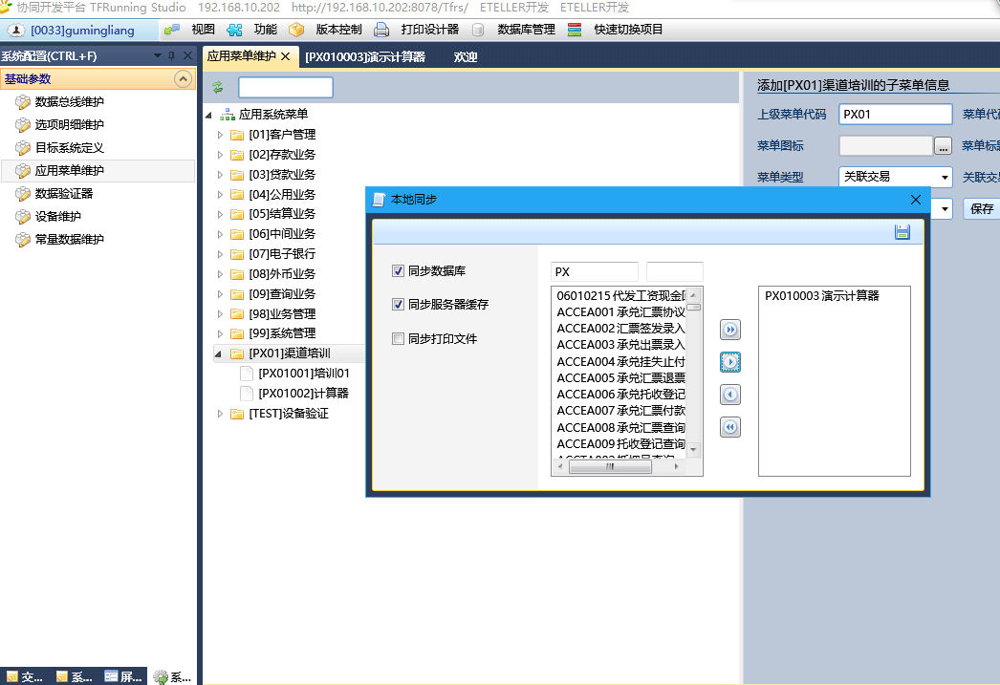

##### 一、TfrunningStudio整体介绍

​	TfrunningStudio（后面简称TFS）是公司自研的前台开发工具。可以进行屏幕页面的绘制、交易的建立、和后台通讯的配置。工具主要有三个功能部分：

​		1：建立交易、建立屏幕、系统资源(选项卡、菜单码、目标系统地址的维护等)、系统交易的维护

​		2：屏幕和交易的具体配置

​		3：总线(用来标识屏幕中的每个域)

##### 二、一个简单的计算器例子

​	1、整体流程：

​		新建屏幕->新建交易->关联屏幕和交易->菜单配置->同步发布

​	2、详细说明:

- 新增屏幕

			（1）选中屏幕资源管理器，点击左上角的“新增屏幕”,在弹出的框里面输入屏幕代码和屏幕名称。（注意：屏幕代码需要输入8位，系统自动取前四位作为分类名称），然后保存。

​	（2）选中“边框控件”，在画布上拖拽，然后在右上角点击“全部自动适应”，按钮，在范围内自动适应满屏幕。

​	规划屏幕中空间数量：两个输入域、一个选择域、一个输出域(输入域和输出域都是文本框)。分割屏幕为四行一列，每一行拖入相应控件后，点击“自动适应”并保存。

​	（3）在分割好屏幕中拖入相应的空间，自动适应保存。调整每个域的TableIndex和Title,并关联标识总线。

TableIndex是敲击回车键时光标的跳入顺序，每个控件要安装从左到右、从上到下的顺序依次增大。

​	（4）每个控件都更改后，点击右上角的“编译并发布”。如果出现下图所示的蓝色字样，说明屏幕发布成功。

- 新增交易

  ​	（5）选中“交易资源管理器”，点击左上角的“新加交易”，在弹出的框中输入交易码和交易名称并保存。（注意：交易码要求长度为8位，系统自动截取前4位作为分类名称）

  

  ​	（6）从“屏幕资源管理器”中拖拽要关联的屏幕到未关联屏幕；在属性中设置整个交易的属性和每个域的“上传”、“下传”属性

  

  ​	（7）在“屏幕[PX010003]演示计算器”选项框中设置每个域的属性，包括初始值、显示、非空验证等属性

  ​	根据计算器的特性，计算数字必须输入，计算结果不能修改，除数不能为0调整每个域。

  

  ​	（8）点击“交易流程”，从右侧流程工具工具栏中拖拽执行按钮到中间画布，配置相关属性。点击数据结构，确认8583报文位图。最后签入。

  

- 菜单配置

  ​	（9）系统配置->应用菜单维护->渠道培训->右键，添加子菜单->填入相关数据

  ​	菜单代码：eTeller中要展示的编码

  ​	关联交易：关联交易的交易码

  

- 同步发布

  ​	（10）功能->工作路径设置，设置本地发布路径为本机的eTeller主目录；功能->本地同步，查询PX010003交易，放到右边，并保存。

  

##### 