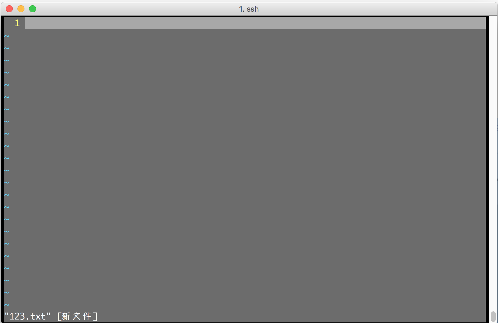
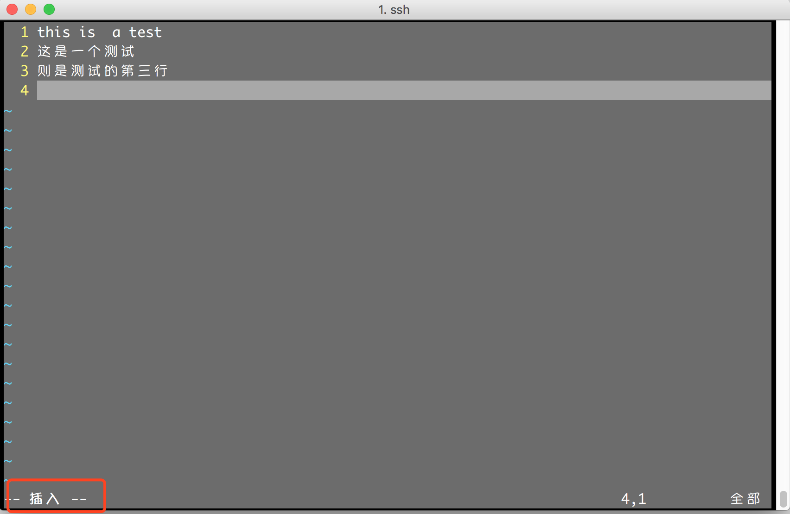
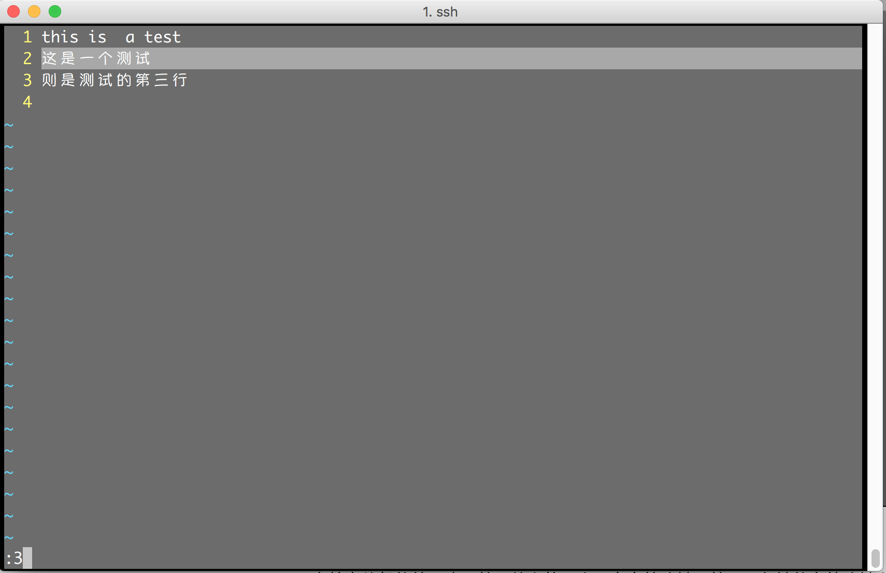

# vI/VIM介绍和基本操作说明

### vi和vim

vi编辑器是Linux和Unix上最基本的[文本编辑器](https://baike.baidu.com/item/%E6%96%87%E6%9C%AC%E7%BC%96%E8%BE%91%E5%99%A8/8853160)，工作在[字符](https://baike.baidu.com/item/%E5%AD%97%E7%AC%A6/4768913)模式下。

vim是vi的扩展版本和升级版本，支持vi的所有功能，并且增加了很多功能。一个定制完整的vim可以媲美IDE。

在linux发行系统中，默认安装的都是vim编辑器。在银行的AIX操作系统（UNIX），默认安装的是vi。

### vi的三种模式

- 命令模式（command mode）

控制屏幕光标的移动，字符、字或行的删除，输入各种处理命令等。

第一次进入vi 或者 按`ESC`键可以进入命令行模式，该模式是vi默认模式。

- 插入模式（Insert mode）

只有在Insert mode下，才可以做文字输入。

按`i`进入插入模式，按`ESC`键可回到命令行模式。

- 底行模式（last line mode）（有时也算做命令模式的一种）

输入`:`进入底行模式（last line mode） 

将文件保存或退出vi，也可以设置编辑环境，如寻找字符串、列出行号……等。

### 基本操作

- 进入vi

在linux系统的/home/xip/user/目录下，输入`vi 123.txt`，则会进入vi 。需要注意，此时vi是命令行模式。

- i 插入 (进入插入模式)

输入字符`i`,会进入插入模式(insert mode)，此时可以正常打字，输入常用的信息:

- ESC退出插入（进入命令行模式)

按键`ESC`，即进入命令行模式(command mode)（右下角的插入标识消失）

- 命令行模式：移动光标`h: 左` `j: 下`  `k: 上` `l: 右`  

  用 VIM 高效率编辑的第一步，就是放弃使用上下左右箭头键。就不用频繁的在箭头键和字母键之间移来移去了，这会节省你很多时间。

- 命令行模式: `x`  删除光标当前所在字符

- 命令行模式: `yy`复制当前行，`p`粘贴当前行到光标所在位置。

- 命令行模式: `dd`删除当前行。

- 命令行模式:·`u`撤销前一个操作,`ctrl+r` 撤销上次撤销操作。

- 底行模式: `:行数`光标会跳转到输入的行数。

- 底行模式: `:wq` 保存文件并退出。如果只想保存，然后继续编辑，可以输入`:w` 。

- 底行模式: `:%s/AAA/BBB/g` 将文件中的所有'AAA'替换为'BBB'。

   