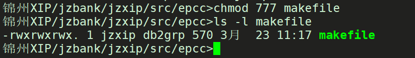
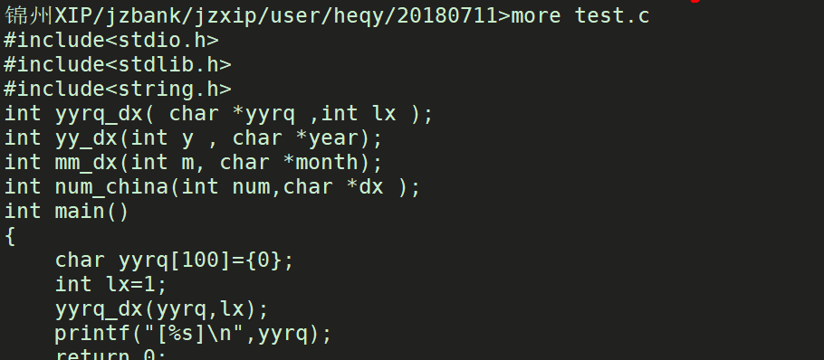
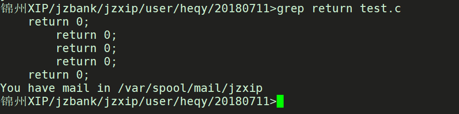

[TOC]

## linux基本使用介绍

### Linux简介

Linux是一套免费使用和自由传播的类Unix操作系统，是一个基于POSIX和UNIX的多用户、多任务、支持多线程和多CPU的操作系统。它能运行主要的UNIX工具软件、应用程序和网络协议。它支持32位和64位硬件。Linux继承了Unix以网络为核心的设计思想，是一个性能稳定的多用户网络操作系统。

### Linux特征

一切都是文件，每个文件都有自己的用处、完全免费、完全兼容POSIX1.0标准、多用户、多任务、良好的界面、支持多种平台

### Linux主流发行版本

CentOS（用户多、2003年年底发行，免费）、 
redhat（用户多、性能稳定，商业版本，需要付费）、红旗（国产的）、 
ubuntu（2004.09发布，适合个人应用）、 
Debian 

> 各个版本命令基本一致

如果你只是需要一个桌面系统，而且既不想使用盗版，又不想花钱购买商业软件，那么你需要一款适合桌面使用的Linux发行版本。

如果你不想自己定制任何东西，不想在系统上浪费太多时间，那么ubuntu是最好的选择。 
如果你需要的是一个服务器系统，而且你已经非常厌烦各种Linux的配置，只是想要一个比较稳定的服务器系统而已，那么你最好的选择就是CentOS了，安装完成后，经过简单的配置就能提供非常稳定的服务了。

### xshell连接linux

linux和window不同，一般都是通过命令界面进行操作。通过xshell连接linux

通过Xshell来访问和连接Linux的步骤

首先你得在你的电脑上安装xshell软件，建议安装shell5社区版，不推荐安装xshell6（社区版限制终端的开启数量），并能和windows进行连接（互相能ping通）；

安装Xshell；

事先最好了解和准备：linux的ip，linux下的某个用户的用户名和密码；

打开XshellX并准备新建连接：


填入新建连接信息：一般使用SSH连接，ssh连接输入加密连接比较安全


确定，保存了连接信息：


点击连接；

下面2步是输入用户名和密码（用你想要连接的linux主机的用户名和密码）；


之后就连接成功了：


其实呢，我们还能通过命令的方式来连接：

ssh + linux的ip；


### 服务进程介绍

举个例子

使用vim编写 test.c程序

```c
#include<stdlib.h>
#include<stdio.h>
#include<string.h>
int main()
{
    print("%s\n","sssss");
}
```

使用gcc编译程序变成可执行程序： gcc test.c -o test

在当前目录启动程序：./test

这其实就是个服务，也叫做进程。但是这个服务打印 “sssss”后就结束了。一般的后台服务会一直存在。

通过kill命令可以结束进程。具体参考kill命令。

## 基本命令介绍

### 文件和目录

- cd /home     进入 '/ home' 目录'

- cd ..                               返回上一级目录

- cd ../..                            返回上两级目录  

- cd                                   进入用户的主目录

- cd ~                                进入用户的主目录 

- cd -                                 返回上次所在的目录

- pwd                                显示当前路径 

- ls                                     查看目录中的文件

- ls -l                                  显示文件和目录的详细资料  

- ls -a                                 显示隐藏文件 

	 ls  aa*                             显示aa开头的文件	

- ls -ltr                               按时间排序并显示文件详细

- mkdir dir1                     当前创建一个叫做 'dir1' 的目录'


- mkdir dir1 dir2             当前目录下同时创建两个目录

- mkdir -p /tmp/dir1/dir2 创建一个目录树

- rm file1                          删除file1文件，需要确认才能删除      

              

- rm -f file1                       删除一个叫做 'file1' 的文件'，不需要确认直接删除


- rm -r dir1                       删除一个叫做 'dir1' 的目录并同时删除目录下所有内容,需要确认

- rm -rf dir2                       直接删除目录及目录下的内容，无需确认，直接删除。

- rm -rf dir1 dir2               同时删除两个目录及它们的内容 

- mv dir1 new_dir            重命名/移动 一个目录

- cp file1 file2                    复制一个文件

- cp -r file1  file2               复制file1目录下所有的东西到file2目录下

-  ln -s file1 lnk1                创建一个指向文件或目录的软链接


### 文件搜索

- find . -name file1           从 当前目录搜索file1文件


- find . -name file*            从当前目录搜索file开头的文件
- find . -name user1 -d    从当前搜索目录user1

### 文件的权限 - 使用 "+" 设置权限，使用 "-" 用于取消

- ls -l                                   显示权限 


-rwxr-xr-x  第一个横线代表文件类型，后边每三个代表一组权限。rwx代表文件所属用户具有r可读w可写x可执行权限，r-x代表所属用户的用户组具有r可读x可执行权限，r-x代表其他用户具有r可读x可执行权限。r在数字上代表4，w代表2，x代表1。

- chmod +x makefile       给文件拥有着用户授予可执行权限

- chmod +r makefile         给文件拥有着用户授予可读权限

- chmod 777 makefile      给所有用户赋予可读可写可执行权限



- chmod 700 makefile       给文件拥有着用户可读可写可执行权限，并取消其他用户所有权限
- chmod -r makefile         取消文件拥有着用户授予可读权限

### 打包和压缩文件

- bunzip2 file1.bz2            解压一个叫做 'file1.bz2'的文件 
- bzip2 file1                         压缩一个叫做 'file1' 的文件 
- gunzip file1.gz                 解压一个叫做 'file1.gz'的文件 
- gzip file1                          压缩一个叫做 'file1'的文件 
- gzip -9 file1                     最大程度压缩 
- tar -cvf archive.tar file1              打包文件file1，并命名为archive.tar
- tar -cvf archive.tar file1 file2 dir1            打包 'file1', 'file2' 以及 'dir1'的三个文件或目录
- tar -xvf archive.tar                                    释放一个包 
- tar -xvf archive.tar -C /tmp                    将压缩包释放到 /tmp目录下 
- tar -cvfj archive.tar.bz2 dir1                 创建一个bzip2格式的压缩包 
- tar -xvfj archive.tar.bz2                       解压一个bzip2格式的压缩包 
- tar -cvfz archive.tar.gz dir1                 创建一个gzip格式的压缩包 


- tar -xvfz archive.tar.gz                     解压一个gzip格式的压缩包 


- zip file1.zip file1                                创建一个zip格式的压缩包 
- zip -r file1.zip file1 file2 dir1            将几个文件和目录同时压缩成一个zip格式的压缩包 
- unzip file1.zip                                  解压一个zip格式压缩包 

### 查看文件内容

- cat file1 从第一个字节开始正向查看文件的内容 
- more file1 查看一个长文件的内容 



- head -2 file1 查看一个文件的前两行 
- tail -2 file1 查看一个文件的最后两行 


- tail -f /var/log/messages 实时查看被添加到一个文件中的内容 

### 文本处理

- grep Aug /var/log/messages                在文件 '/var/log/messages'中查找关键词"Aug" 



- grep ^Aug /var/log/messages              在文件 '/var/log/messages'中查找以"Aug"开始的词汇 
- find . -name *.c|xargs grep return      从当前目录下开始搜索包含return字符串的全部以“.c"结尾的文件。并显示
- grep -r log *                                             在当前目录下搜索所有包含log字符串的文件的行
- grep [0-9] /var/log/messages               选择 '/var/log/messages' 文件中所有包含数字的行 
- echo a > file                                              往file文件中写入字符a如果文件有内容清空，无文件则自动建立
- echo a >>file                                              在文件尾添加字符a
- diff a b                                                      比对a与b文件的不同

### 网络与进程

- ps -ef                                                       查看进程
- ps -ef|grep test                                     查看包含test字符的进程


- kill -9 进程号                                           强制杀死进程，根据进程号


- netstat -aop|grep 9768                     查看9768端口是否被使用  ctrl+c退出
- lsof -i:9768                                             查看端口是否被占用
- ping 192.168.10.202                         查看通往此ip的网络是否通
- telnet 192.168.10.202 9999            查看192.168.10.202机器上使用9999端口的服务是否启动

### 环境变量

- env                                               查看全部环境变量
- env|grep HOME                        查找HOME环境变量
- echo $HOME                              查看HOME环境变量的值
- export AA=11                             设置环境变量，仅当前登陆终端有效

	ATH环境变量                            PATH环境变量包含了很多目录。在这些目录里面的可执行程序，在任何目录都可              	 以执行


### 命令小技巧

tab键可以自动补齐或者查询出所有相似的命令


使用上键和下键可以翻看使用的历史命令记录

## shell介绍

### shell基本介绍

Shell是系统的[用户界面](https://baike.baidu.com/item/%E7%94%A8%E6%88%B7%E7%95%8C%E9%9D%A2)，提供了用户与[内核](https://baike.baidu.com/item/%E5%86%85%E6%A0%B8)进行交互操作的一种[接口](https://baike.baidu.com/item/%E6%8E%A5%E5%8F%A3)。它接收用户输入的命令并把它送入内核去执行  。

实际上Shell是一个命令[解释器](https://baike.baidu.com/item/%E8%A7%A3%E9%87%8A%E5%99%A8)，它解释由用户输入的命令并且把它们送到内核。不仅如此，Shell有自己的编程语言用于对命令的编辑，它允许用户编写由shell命令组成的程序。Shell编程语言具有普通编程语言的很多特点，比如它也有[循环结构](https://baike.baidu.com/item/%E5%BE%AA%E7%8E%AF%E7%BB%93%E6%9E%84)和分支控制结构等，用这种编程语言编写的Shell程序与其他应用程序具有同样的效果。

Linux提供了像[Microsoft](https://baike.baidu.com/item/Microsoft)[Windows](https://baike.baidu.com/item/Windows)那样的可视的命令输入界面--[X Window](https://baike.baidu.com/item/X%20Window)的[图形用户界面](https://baike.baidu.com/item/%E5%9B%BE%E5%BD%A2%E7%94%A8%E6%88%B7%E7%95%8C%E9%9D%A2)（[GUI](https://baike.baidu.com/item/GUI)）。它提供了很多[桌面环境](https://baike.baidu.com/item/%E6%A1%8C%E9%9D%A2%E7%8E%AF%E5%A2%83)系统，其操作就像Windows一样，有窗口、图标和菜单，所有的管理都是通过鼠标控制。[GNOME](https://baike.baidu.com/item/GNOME)。

每个[Linux](https://baike.baidu.com/item/Linux)系统的用户可以拥有他自己的[用户界面](https://baike.baidu.com/item/%E7%94%A8%E6%88%B7%E7%95%8C%E9%9D%A2)或Shell，用以满足他们自己专门的Shell需要。

同Linux本身一样，Shell也有多种不同的版本。主要有下列版本的Shell：　Bourne Shell：是[贝尔实验室](https://baike.baidu.com/item/%E8%B4%9D%E5%B0%94%E5%AE%9E%E9%AA%8C%E5%AE%A4)开发的。

BASH：是[GNU](https://baike.baidu.com/item/GNU)的Bourne Again Shell，是GNU操作系统上默认的shell。

Korn Shell：是对Bourne SHell的发展，在大部分内容上与Bourne Shell兼容。

C Shell：是SUN公司Shell的BSD版本。

Z Shell：The last shell you’ll ever need! Z是最后一个字母，也就是终极Shell。它集成了bash、ksh的重要特性，同时又增加了自己独有的特性。

### shell脚本介绍

shell脚本是基于shell命令的一个集合。可以包含多个命令并和c、java语言类似有if，for等语法

打开文本编辑器(可以使用vi/vim命令来创建文件)，新建一个文件test.sh，扩展名为sh（sh代表shell），扩展名并不影响脚本执行，见名知意就好，如果你用php写shell 脚本，扩展名就用php好了。 

输入一些代码，一般是这样： 

```shell
#!/bin/bash
echo "hello world" #往终端输入字符串hello world

```

第一行不是必须的，但是建议。

执行方式  ./test.sh  或者sh test.sh


