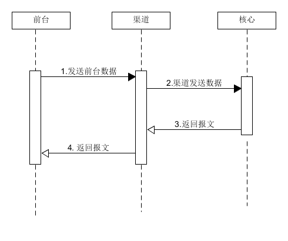
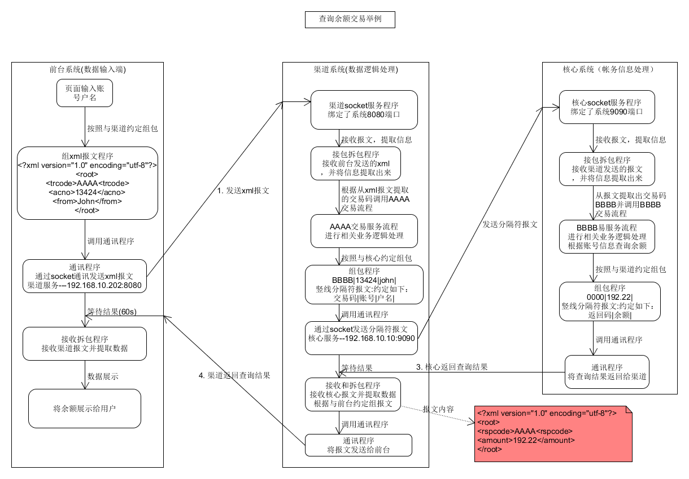
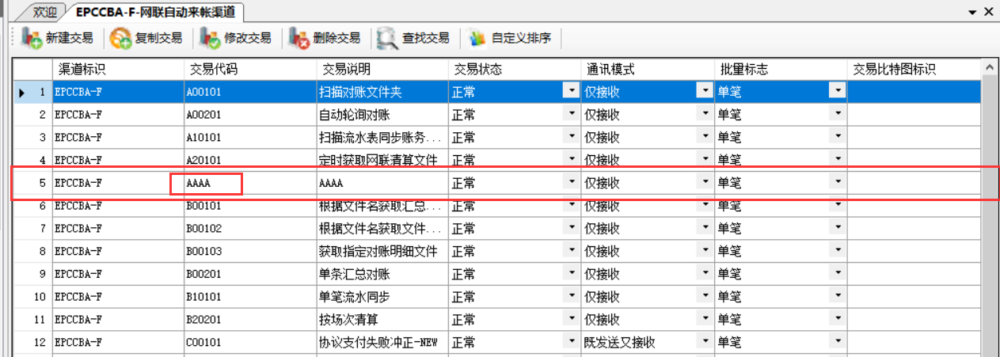
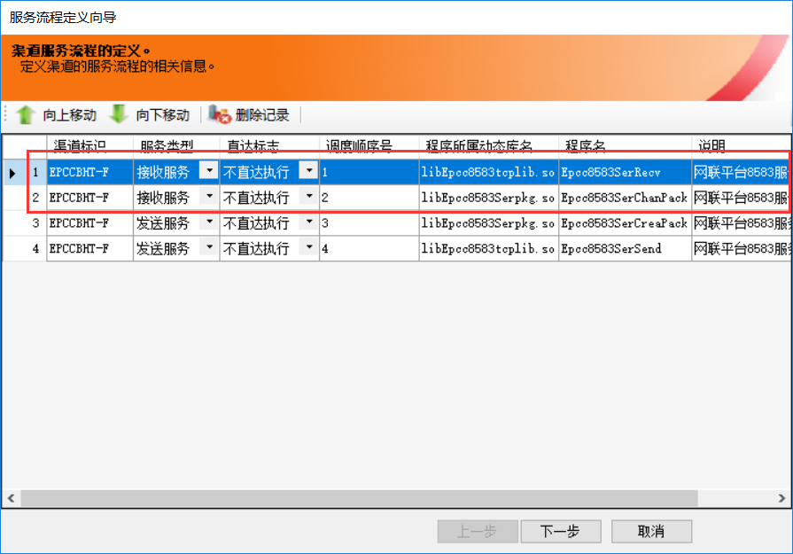
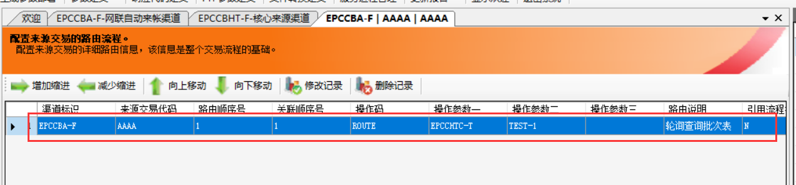
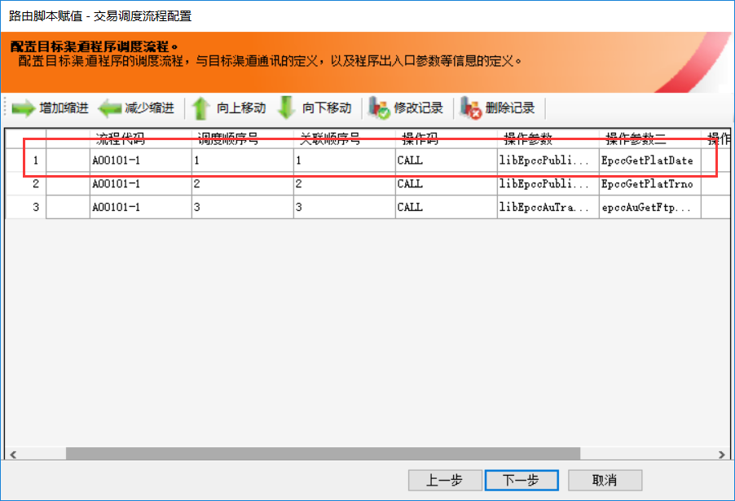
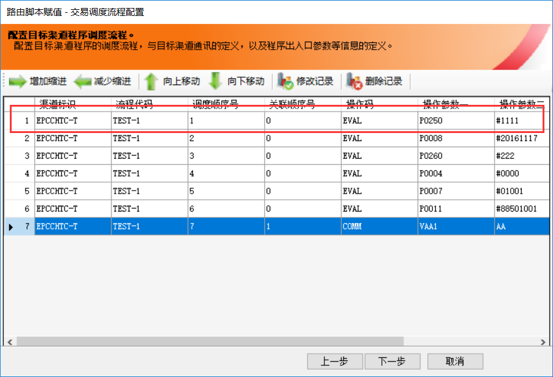
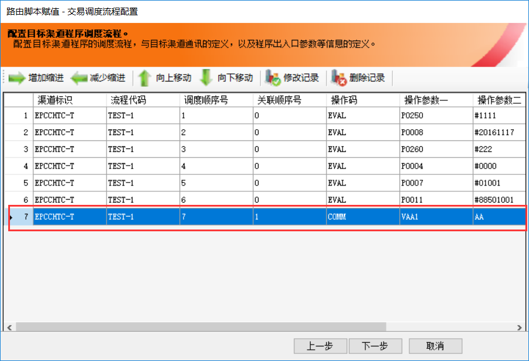
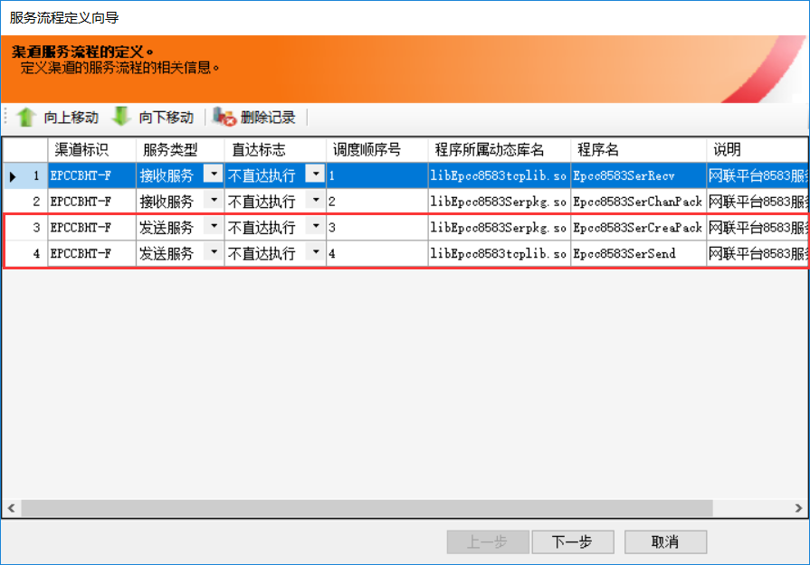

[TOC]

#### 交易发起时序图一览

1. 前台发起交易并提交数据
2. 渠道系统接收前台数据
3. 渠道发送数据给核心系统
4. 核心系统接收数据并将结果返回
5. 渠道接收核心报文
6. 渠道返回核心报文给前台

   

#### 交易流程总体详细流程

以查询余额交易举例，流程中使用的报文接口及报文类型仅仅是为了理解进行的举例说明，与实际查询使用的报文接口及报文类型有偏差。

#### 前台填写数据

前台与用户进行交互的工具，可以收集用户填入的信息及展示相关信息。前台或者数据输入端是交易数据的来源，以及交易数据的开始，如下图，就是一个数据输入端。用户通过填写数据，并点击登陆可以传输输入数据。

#### 组成报文

用户点击提交后，前台程序按照与渠道的约定组成报文，如余额查询交易，前台将输入信息组成如下报文

~~~xml
<?xml version="1.0" encoding="utf-8"?>
<root>
	<trcode>AAAA<trcode>
	<acno>13424</acno>
	<from>John</from>
</root>
~~~

trcode节点是交易码字段，渠道接收报文后根据交易码调用服务流程AAAA。

acno节点是账号节点，用于查询余额的信息。

from是户名节点，用于查询余额的信息。

#### 来源渠道主程序

~~~c
#include "kernel/syspub.h"
#include "kernel/xipcmstc.h"
#include "kernel/kprsman.h"
#include "bmp/bmp_pubdef.h"
#include "bmp/bmp_msg.h"
#include <sys/types.h>
#include <sys/ipc.h>
#include <sys/msg.h>

#define SA struct sockaddr
#define Listenunit 10

static int bmpGetServerLock();//通过创建锁，避免重复启动服务程序。因为函数setsockopt使该服务程序的端口能被重复绑定，通过锁能避免服务程序重复启动。

void exit_server(int s)//此函数用于杀死该服务程序时执行，如kill -10 进程id 是将执行该程序
{
    printf("\n### BmpTcpServer NORMAL EXIT ###\n");
    exit(0);
}

int main(int argc, char *argv[])
{
    int newsock, sock, i;
    struct sockaddr_in sin ;
    unsigned short portnum;
    socklen_t namelen;
    
    int optvar = 0, optlen = 0, ret = 0;
    char execstr[256];

    TxipCMStc xip;   /*XIP通用结构*/
    TApPrsPrm JA;//服务进程参数
#if 0
  typedef struct SApPrsPrm
{
  char    cXipId[11];       /*服务渠道标识*/
  char    cXipName[51];     /*服务渠道名称*/
  char    cPgmVer[7];       /*服务程序版本号*/
  char    cShmKey[2];       /*进程管理共享内存KEY*/
  int     iMaxPrs;          /*服务最大进程数*/
  int     iFstPrs;          /*服务预起进程数*/
  int     iValve;           /*进程阀门值*/
  int     iActNo;           /*进程数达到阀值时激活进程数*/
  int     iManCyc;          /*进程管理周期（秒）*/
  int     iClrCyc;          /*进程清理周期（秒）*/
}TApPrsPrm;
#endif
    if (argc != 4)/*我们公司服务启动方式    PmtsServerSP PMTS PMTS-F 8899，此处进行判断是否合法*/
    {
        printf("\n usage: %s XIPSID XIPID PORT\n\n", argv[0]);
        exit(-1);
    }
   
    /*判断端口不能是字母只能是数字,此函数isdigit判断字符如果是字母返回0，是数字返回‘true’*/
    for(i=0; i<strlen(argv[3]); i++)
    {
         if (!isdigit(argv[3][i]))
         {
             printf("\n usage: %s PORT\n\n", argv[0]);
             exit(-1);
         }
    }

    portnum = atoi(argv[3]);//将数日的第三个参数转化为整数
    if (portnum <= 1024)//此处判断端口是否大于1024，小于1024就报错退出
    {
        printf("\n端口号[%s]小于1024!\n", argv[3]);
        exit(-1);
    }

   strcpy(xip.xipFromSID, argv[1]);//将参数一赋给来源渠道上级ID，如清分管理渠道BMP
   strcpy(xip.xipFromID, argv[2]);//将参数二赋给来源渠道，如清分来源渠道BMP-F

   ret = GetXipSysCfg();
//此处从XIPSYS.cfg获得配置信息
   if (ret)
   {
      printf("\n读取XIP配置文件失败ret=[%d]\n", ret);
      exit(-1);
   }

   ret = XipInit(&xip, &JA);
//从DB.cfg中获得XIP的交换基础平台数据配置信息以及Mxip_frid的业务应用系统数据配置信息 ，根据渠道基本信息配置进行初始化，渠道平台系统数据总线初始化等等。
   if (ret)
   {
      printf("\n Call XipInit Error=[%d][%s]!\n", ret, xip.xipReplyCode);
      exit(-1);
   }
//此处使用signal屏蔽关联终端的一些信号，避免杀死程序比如终端下的"ctrl+c"信号，设置用户自定义服务结束处理函数exit_server，通过kill -10调用。
   signal (SIGHUP,SIG_IGN);
   signal (SIGINT,SIG_IGN);
   signal (SIGQUIT,SIG_IGN);
   signal (SIGTERM,SIG_IGN);
   signal (SIGCHLD,SIG_IGN);
   signal (SIGUSR1,exit_server);

   
   if ((sock = socket(AF_INET, SOCK_STREAM, IPPROTO_TCP)) < 0)
   {
      perror("socket");
      APPLOG("E", "--->%s,%d建立sock失败!!!", __FILE__, __LINE__);
      exit(1);
   }
   
  
   optvar = 1;
   optlen = sizeof(optvar);
 //设置端口绑定，使服务启动时，立即能绑定该端口，不经历time-wait。  
   ret = setsockopt(sock,SOL_SOCKET,SO_REUSEADDR,(char *)&optvar,optlen);
   if (ret == -1)
   {
      APPLOG("E", "%s: setsockopt error!", argv[0]);
      exit(-1);
   }

   bzero((char*)&sin, sizeof(sin));
   sin.sin_family = AF_INET;
   sin.sin_port = htons(portnum);//主机转网络类型
   sin.sin_addr.s_addr = INADDR_ANY;
   
   if (bind(sock, (SA *)&sin, sizeof(sin)) < 0)
   {
      perror("bind");
      APPLOG("E", "---> %s,%d绑定失败!!!", __FILE__, __LINE__);
      exit(1);
   }
   
   namelen = sizeof(sin);
//函数用于获取与某个套接字关联的本地协议地址，如果bind绑定失败返回-1
   if (getsockname(sock, (SA *)&sin, &namelen) < 0)
   {
      perror("getsockname");
      APPLOG("E", "---> %s,%d取主机信息失败!!!", __FILE__, __LINE__);
      exit(1);
   }

//此处用于创建子进程，并使父进程退出。因为父进程在进程退出前退出，子进程将被init进程接管进而能在一定程度上脱离关联终端。根据fork函数特性，子进程复制了父进程除栈外的所有资源。
   if (fork()) 
   {
      exit(0);
   }
   //设置sock处于监听状态
   if (listen(sock, Listenunit) < 0)
   {
      perror("listen");
      APPLOG("E", "---> %s,%d建立listen失败!!!", __FILE__, __LINE__);
   }
//通过锁判断服务是否启动
    ret = bmpGetServerLock();
    if( ret != 0)
    {   
        APPLOG("E", "创建文件锁失败!!");
        printf("创建文件锁失败");
        return -5; 
    }

   
   printf("\n--->服务启动成功开始监听!\n");
   APPLOG("I", "--->服务启动成功开始监听!!!!");
    
   while(1)
   {
      printf("\n--->开始等待接收请求\n");
      APPLOG("I", "--->开始等待接收请求");
      namelen = sizeof(sin);
//等待客户端连接，程序执行到此处时，如果没有客户端连接将处于阻塞状态。
      if ((newsock = accept(sock, (SA *)&sin, &namelen)) < 0)
      {
         APPLOG("E", "--->接收请求失败!!!");
         continue;
      }
   
      printf("\n--->接收到【%d】【%s】的请求!\n\n",
                           newsock, inet_ntoa(sin.sin_addr));
      APPLOG("I", "--->接收到【%d】【%s】的请求!",
                           newsock, inet_ntoa(sin.sin_addr)); 
//当每有客户端连接时，这个子进程创建就一个子进程，这个子进程也会复制创建他的父进程除栈所有资源。这就避免当多个客户端连接时，资源竞争问题。因为每个子进程都复制父进程的一份资源，平台总线编码已经在最初的父进程中初始化，所有每个子子进程都有一套属于自己的平台数据编码。如变量编码0300，每个子子进程都有0300，互不影响，不会出现两个都使用0300编码的交易同时触发时，一个交易用了0300导致另一个被覆盖的问题。
      if (fork() == 0)
      {
         signal(SIGUSR1,SIG_IGN);/*此处为子进程忽略用户定义的SIGUSR1信号，当业务在执行的时候不能通过kill -10杀死*/
         close(sock);
   
         /*开始进行主控流程的调度*/
         ret = AppDbOpen();
         if (ret)
         {
            APPLOG("E", "Call AppDbOpen Error=[%d][%s]!", ret, xip.xipReplyCode);
            close(newsock);
            return ret;
         }

         ret = DbBeginWork();
         if (ret)
         {
            APPLOG("E", "Call DbBeginWork Error=[%d][%s]!", ret, xip.xipReplyCode);
            close(newsock);
            AppDbClose();
            return ret;
         }

         xip.xipSocketId = newsock;
//此处开始进行服务流程调度以及交易流程执行
         ret = XipMainFlow(&xip);
         if (ret)
         {
            APPLOG("E", "Call XipMainFlow Error=[%d][%s]!", ret, xip.xipReplyCode);
            close(newsock);
            AppDbClose();
            return ret;
         }

         ret = AppDbClose();
         if (ret)
         {
            APPLOG("E", "Call AppDbClose Error=[%d][%s]!", ret, xip.xipReplyCode);
            close(newsock);
            return ret;
         }
         
         printf("\n<---调用[%s]进行通讯处理完毕!\n\n", argv[0]);
         APPLOG("I", "<---调用[%s]进行通讯处理完毕!", argv[0]);
   
         close(newsock);
         return 0;
      }
      close(newsock);
   }
}

static int bmpGetServerLock()
{
    int fd;
    struct  flock lock;
    char    fullname[201];
	sprintf(fullname, "%s/%s/SERVER_LOCK", getenv("HOME"), MSGTOKEY) ;
    fd=open(fullname,O_WRONLY|O_CREAT,S_IRUSR|S_IWUSR);
    if(fd<=0)
    {
        APPLOG("D","打开文件锁文件错误[%s]",fullname);
        return -5;
    }

    lock.l_type=F_WRLCK;
    lock.l_start=0;
    lock.l_whence=SEEK_SET;
    lock.l_len=0;

    if(fcntl(fd,F_SETLK,&lock))
    {
        APPLOG("D","文件锁存在");
        return 1;
    }
    else
    {
        APPLOG("D","创建文件锁成功[%s]",fullname);
    }

    return 0;
}
~~~

#### 通讯服务程序接收、拆包

当服务程序接收到socket连接是会调用接收程序和拆包程序，接收程序负责接收报文，拆包程序负责提取报文信息。

#### 配置的交易执行

当拆包程序拆出报文信息，并获得交易码时。调用渠道对于交易。

- 路由层

  路由层分本地路由，如  XXXX-L（本地渠道）。目标路由，如 XXXX-T(目标渠道)。本地路由可以承载程序的调用；总线的赋值；if逻辑的判断等。目标路由还可以承载comm，comm会调用目标渠道的服务流程进行通信（comm相当于socket客户端程序），将报文信息发给相关服务。

  

  - CALL

    调用业务程序

    

  - EVAL

    给总线赋值

    

  - COMM

    进行通信，将报文发给相关服务，比如核心。

    

#### 通讯服务程序组包（组成字符串）、返回

当路由层执行完毕，会按照约定组成返回报文，并发送。

​	