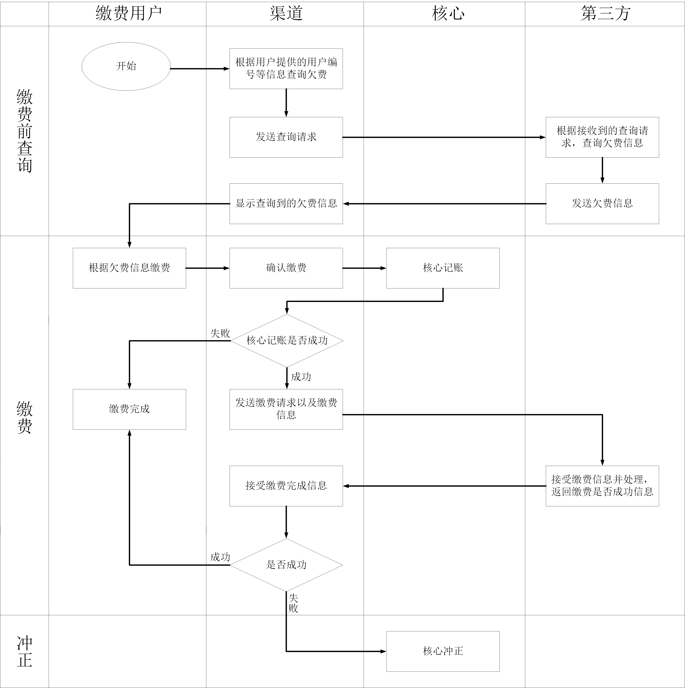
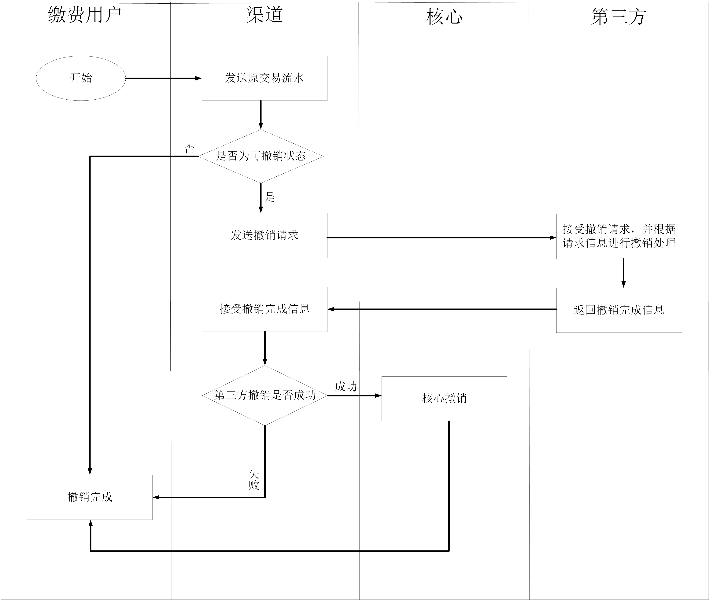
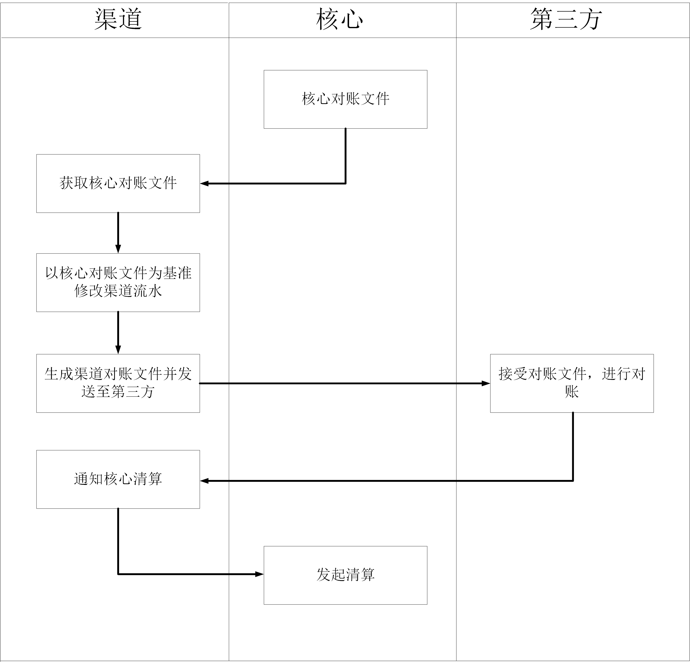
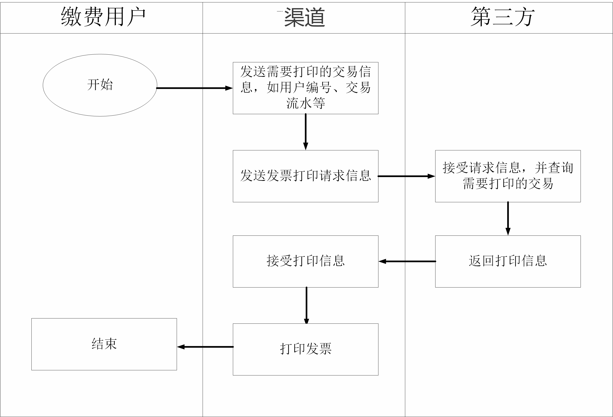

# 代缴费各业务场景和流程介绍

### 代缴费业务简介

1. 代缴费业务：指客户通过银行办理各种生活缴费，如：代缴电费、代缴水费、代缴取暖费等。

2. 渠道：也就是我们所负责的部分。

   核心：银行的核心系统。

   第三方：例如代缴电费，第三方指的就是电力公司；如果是代缴水费，第三方指的就是自来水公司等。

3. 不同的代缴费业务流程并不是完全相同，但是基本由以下六部分组成：

   - 缴费前查询：代缴费的第一步，通过用户提供的资料查询出缴费金额等信息
   - 缴费：根据缴费前查询返回的信息进行缴费操作
   - 缴费撤销：如果缴费出现错误，例如客户缴错了等情况可以对缴费进行撤销
   - 流水查询：通过特定的条件查询出某笔交易的流水
   - 对账及清算：银行把一天所有的交易信息与第三方进行核对，并把收到的资金转给第三方的过程
   - 发票打印：银行在收到客户缴纳的费用之后打印给客户收款凭证等票据

### 代缴费业务流程介绍

1.缴费前查询、缴费

- 缴费前查询：银行查询用户欠费信息时调用此交易 ，渠道把客户提供的缴费编号、手机号码等请求信息发送到第三方，然后第三方根据接收到的请求信息查询该用户的欠费金额等缴费信息并返回给渠道。
- 缴费：渠道根据第三方返回的缴费前查询结果确定用户的欠费金额、余额等信息后调用此交易，在用户缴款之后，渠道把缴费信息发往核心记账，核心记账成功后渠道把缴费信息发送给第三方，第三方处理接收到的缴费信息并返回缴费成功或者失败，渠道接受第三方返回的缴费状态信息并告知客户。
- 冲正：如果渠道收到第三方返回信息缴费失败，会通知核心撤销这笔缴费。

2.缴费撤销

- 缴费撤销：在某些特殊情况下（如用户缴错或银行出现错误等）调用此交易，渠道通过原缴费流水查询数据库该交易是否为可撤销状态（缴费成功或第三方通讯超时等），如果缴费可撤销则把交易流水发送给第三方，第三方根据收到的撤销信息进行撤销处理，并将成功或失败结果反馈给渠道，如果第三方撤销成功，渠道通知核心进行撤销，如果第三方撤销失败则交易结束。

3.流水查询

- 流水查询：银行根据特定条件查询数据库中符合条件的交易流水

4.对账、清算

- 对账：通俗的讲就是把一天中银行方所有缴费信息和第三方的缴费信息进行核对，首先渠道获取核心对账文件，根据核心对账文件修改渠道流水，然后按照第三方文件格式要求组装对账文件发往第三方，文件发送结束后通知核心清算。
- 清算：在客户去银行缴费时，银行会先把收到的资金存放在第三方在银行开立的内部账户中，渠道把对账文件发送到第三方之后，通知核心进行清算，核心会把资金从内部户转到第三方的结算户中，简单来说，清算就是一个银行给第三方转账的过程。

5.发票打印

- 第三方控制发票格式：本质上与缴费前查询类似，银行在收费完成之后如果需要打印票据，调用此交易。渠道选择需要打印的交易票据，然后把本次交易的用户编号、交易金额等信息传递给第三方，第三方在收到请求之后把需要打印的票据信息内容传递给渠道，银行打印发票交给客户。
- 第三方不控制发票格式：例如银行自己提供的收款凭证等，这种发票无需通过第三方，渠道根据查询条件查询数据库中符合条件的记录，按照发票格式打印。