​	在之前的TFS中只是配置了计算器的界面，计算器的核心功能——计算并没有实现，这就需要我们在后台来实现，现在的后台就是XIP（交换基础平台）。整个配置流程如下：

#### 程序配置

1. 登录VDMP，点击"程序开发管理"，在"练习/PRAC2018"程序类别上"右键-新建程序文件"，填入程序名、程序后缀、中文名、描述，勾选文件创建（自动创建的程序位置在程序分类中可以查看）。下一步。

   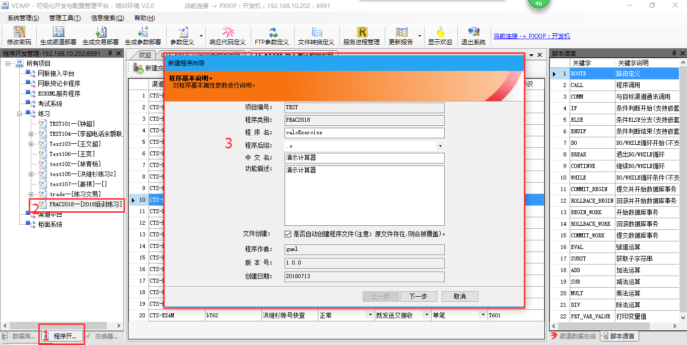

   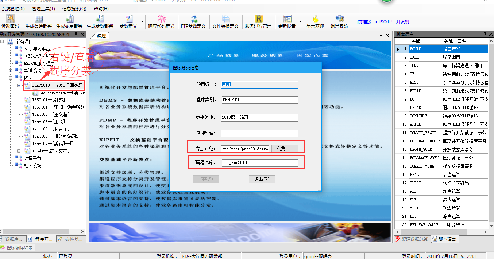

2. 点击"新增函数"，在弹出的对话框中输入函数名、描述。如果该程序下只有一个函数，函数名和程序名保持一致。下一步。

   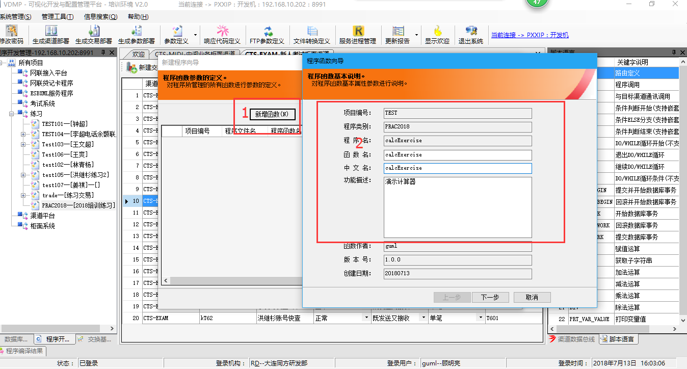

3. 程序函数操作表的定义，本次没有函数表要操作。下一步，函数入口参数的定义。这个地方要选择的数据编码和TFS中控件的编码要对应。修改参数说明和输入输出标志。TFS中的上传对应此处的输入，TFS中的下传对应该处的输出。下一步，到完成。

   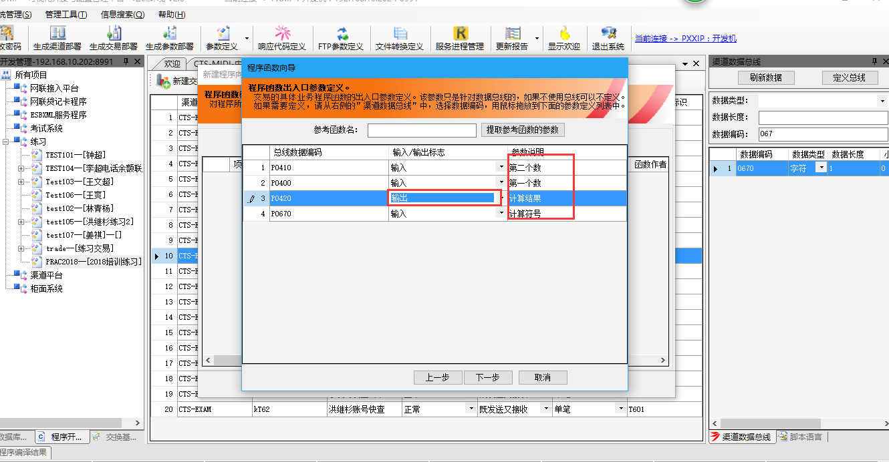

4. 最后弹出如下界面，在上面的标签右键/关闭当前程序。

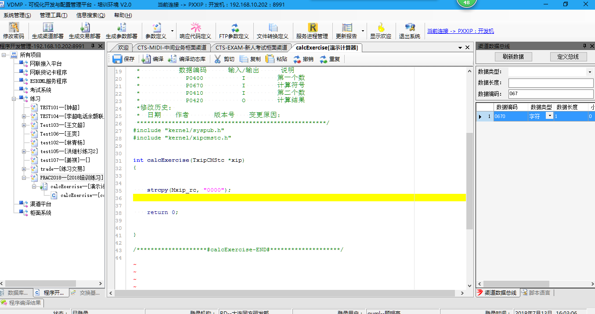

#### 交易定义配置及关联程序

1. 打开"交换基础平台/柜面系统渠道/中间业务柜面渠道"，点击"新建交易"，在弹出的对话框中填入交易信息（交易码和TFS中交易配置/交易流程/交易代码保持一致）。下一步。

   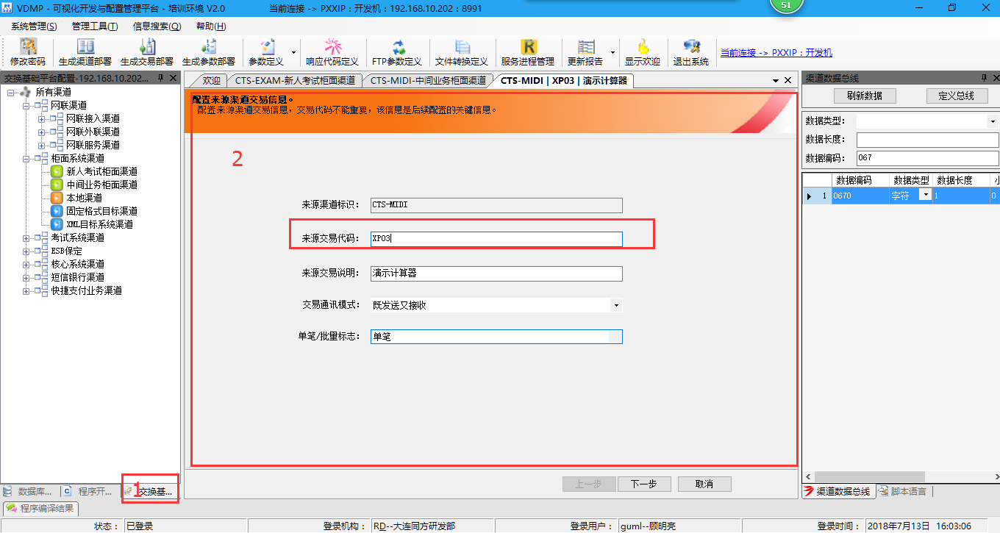

2. 在右侧功能区的脚本语言选项卡中去，拖拽"ROUTE"指令到中间功能区，在弹出的对话框中填入路由信息（流程代码的规范是交易码-数字递增）。下一步。

   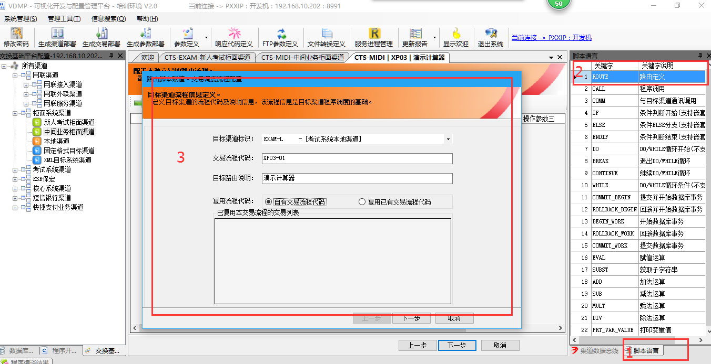

3. 拖拽"CALL"指令到中间功能区，弹出对话框，从刚才新加的函数中拖拽函数到该对话框。确定->完成->下一步。

   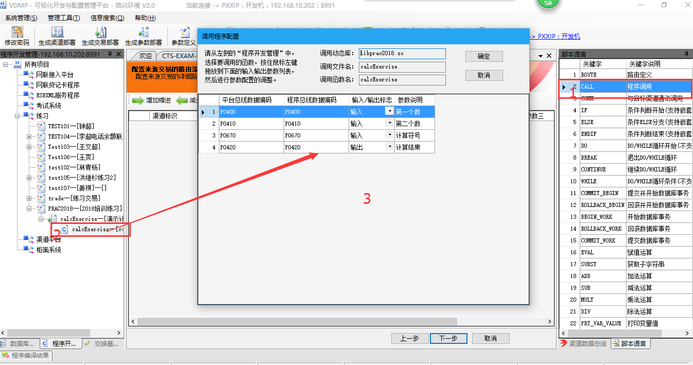

4. 在左侧的BITMAP中勾选需要返回柜面的数据编码。右侧填写BitId和说明并点击生成 比特图。

   （BitId的规范是交易码-渠道简称）。下一步完成。

   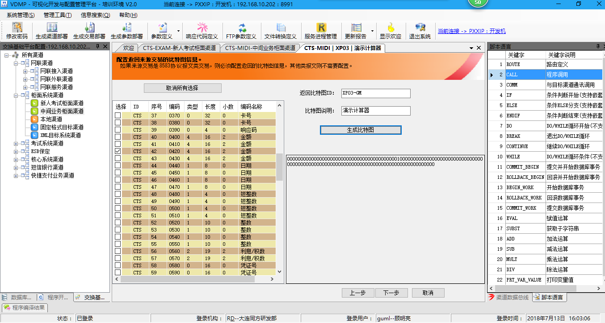

至此，整个交易流程都配置完成了。

#### 数据库配置

​	数据库管理工具帮助我们通过可视化工具快速的生成建表语句，表操作函数，头文件。

1. 在表类型"练习"上右键/新建表，弹出的定义框里面填入表名、字段信息。下一步。

   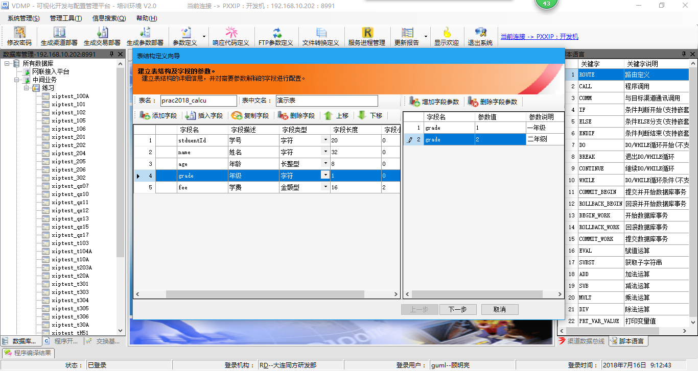

2. 点击"新建索引"，选择索引类型(唯一/非唯一)，从左边列中拖拽要作为索引字段的列到右下方的框中。完成。

   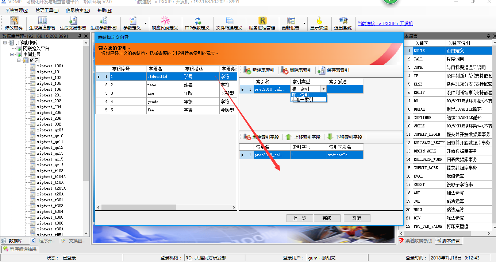

3. 在新加的表上，右键/生成表头文件，会生成两个头文件,tablename_c.h和tablename.h。tablename_c.h在业务程序中使用。保存路径一般放在src/incl/项目名/tabincl中。

   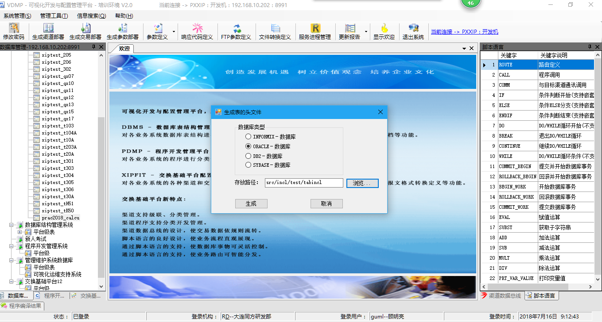

4. 右键/生成表操作函数。函数模版的不同点主要在引用头文件的路径不同，可以根据自己头文件的路径，新建新的模版。

   

   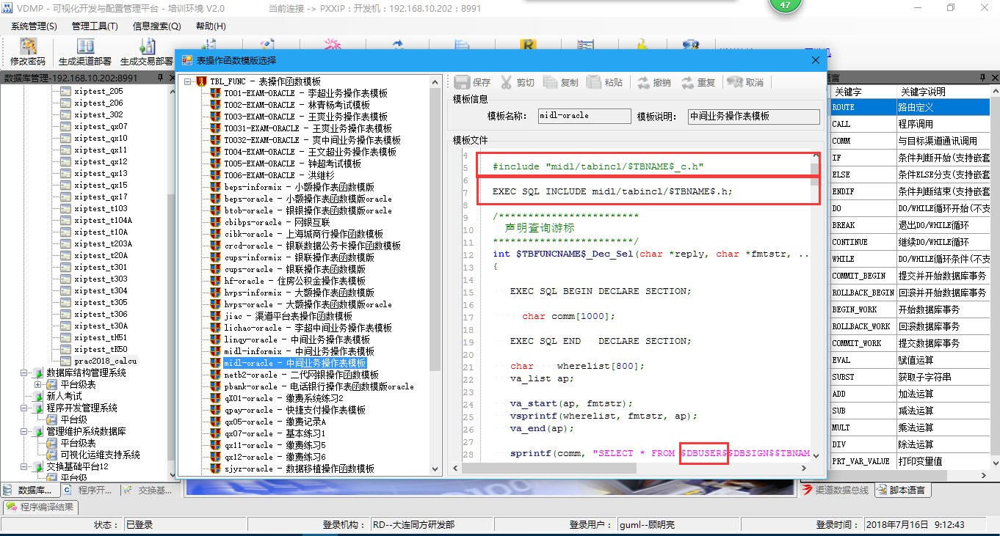

5. 右键/生成建表脚本。在选择的目录中会生成如下图所示的文件

   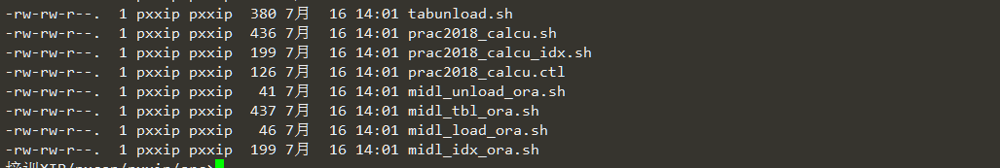

   tabunload.sh：主要用来从数据表中导出数据为txt，适合大批量的数据导出

   tablename.sh：建表脚本shell

   tablename_idx.sh：建立索引的shell

   tablename.ctl：导入数据的控制文件

   schema_unload_ora.sh：tabunload.sh的封装

   schema_tbl_ora/schema_idx_ora.sh：该数据库下所有表和索引的建立脚本

   schema_load_ora.sh：数据导入文件，配合tablename.ctl使用

   注意：上述所有shell的执行需要注意数据库链接是本地还是远程。有关数据库的本地链接和远程链接方式请百度。

   本地链接：sqlplus username/passwd

   远程链接：sqlplus username/passwd@netaliasname

   ​		    sqlplus username/passwd@//ip:port/instance

#### 渠道定义和配置详解

​	渠道，顾名思义就是数据、信息流转的通道。可以根据不同的场景、业务，对数据分类、分流，让整个业务层次更清晰，管理、重用更方便。

​	XIP中的渠道分为管理渠道、本地渠道、来源渠道、目标渠道四大类。

##### 	管理渠道：

​	是其他三个渠道的上级渠道，本身不包含配置信息。

##### 	本地渠道：

​	主要对交易进行分类。

##### 	来源渠道：

​	监听远端请求，进行报文转换。

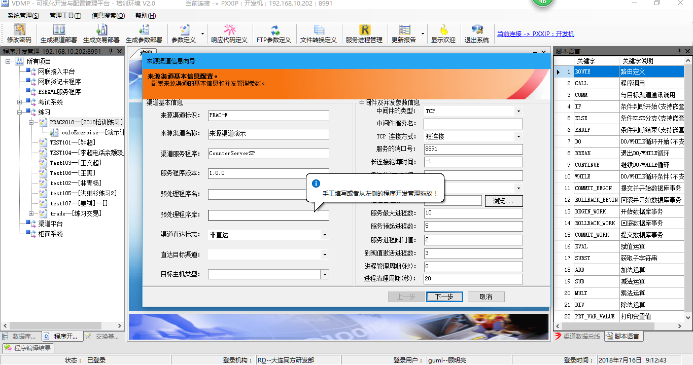

​		来源渠道标识（Mxip_frid）：唯一标识该来源渠道，通常的命名规范是“业务类型-F”。

​		渠道服务程序：必须填，暂时没有用。服务程序由启动脚本来指定。

​		服务程序版本：暂时没有用

​		预处理程序：暂时没有用

​		渠道直达标志：作服务穿透用。如果选择直达，则不处理该渠道下的任何交易，直接路由到“直达目标渠道”指定的渠道。

​		中间件的类型：通讯的中间件类型

​		TCP连接方式：必须选。后台暂时没有用。

​		服务端口号：必须填写。后台暂时没有用。

​		服务并发标志：单进程/多进程

​		进程管理的KEY：多进程使用。现在的服务程序版本并没有用，但是如果填写为N的话，服务程序的运行状况将不会被监控。

​		服务最大进程数：进程池允许的最大进程数

​		服务预启进程数：服务启动的时候启动的进程数,不能超过服务最大进程数

​		服务进程阀门值：当空闲进程数小于该值时，则新启动进程。该值不能大于等于预启进程数

​		到阀值激活进程数：当空闲进程数达到阀值新启动的进程数量

​		进程管理周期：暂时没有用

​		进程清理周期：一个进程的使用次数达到该值的时候，则结束该进程

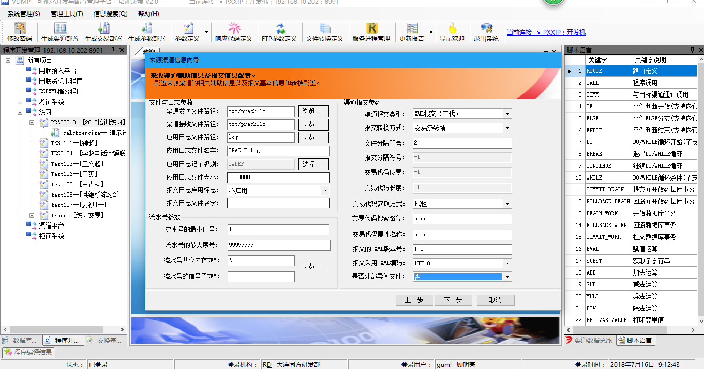

​		渠道发送文件路径(Mxip_sfpath)

​		渠道接收文件路径(Mxip_rfpath)

​		应用日志文件路径：zlog版本中该变量没有使用。非zlog版本中如果为配置默认路径是/tmp

​		应用日志文件：如果为空，zlog版本中日志文件是Mxip_frid.log。非zlog版本是app.log

​		应用日志级别：选择要打印的日志级别

​		应用日志文件大小：非zlog版本的归档日志文件大小（单位为字节）。zlog版本已弃用

​		报文日志：PKG日志的控制开关

​		流水号的最小序号（Mxip_minseq）：流水序列的最小值

​		流水号的最大序号（Mxip_maxseq）：流水序列的最大值

​		流水号的共享内存（Mxip_shmkey)：流水序列的自动命名规范xip_sequence_shamkey

​		

​		文件分割符号（Mxip_frfsign）：文件分隔符，十进制数表示。常用的有124（竖线分隔符），2（^B分隔符）。建议用2，汉字GBK编码下，部分汉字占用了48以上的字节

​		报文分隔符号（Mxip_frsign）：同上

​		交易代码位置（Mxip_frtcdpos）

​		交易代码长度（Mxip_frtcdlen）：和交易代码位置配合用来获取交易码

​		交易代码获取方式（Mxip_frxpmode）：XML报文配置获取交易码方式

​		交易代码搜索路径（Mxip_frxpath）：获取方式为节点时候的xpath

​		交易代码属性名称（Mxip_frattrnm）：获取方式为属性时候的属性名

​                **XML报文头 `<?xml version="1.0" encoding="utf-8" standalone="yes" ?>`**

​		报文的xml版本编号：对应上面的version属性

​		报文的xml编码：encoding属性

​		是否外部导入文件：standalone属性

##### 目标渠道：

​	定义报文接收方的ip信息、报文信息格式

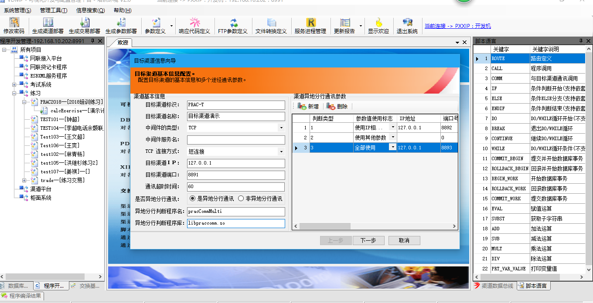

​		目标渠道标识：默认的定义规范是“业务类型-T”

​		是否异地分行通讯：可以根据不同的条件选择不同的参数和ip信息。查询条件是Mxip_tgid和总线MULTCOMMTYPE（0053）中的值

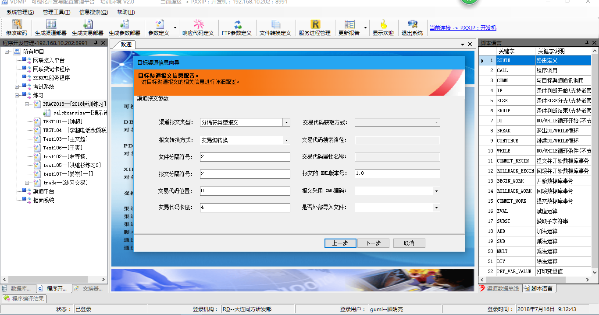

​		文件分隔符号（Mxip_tgfsign）

​		报文分割符号（Mxip_tgsign）	

​		交易代码位置（Mxip_tgtcdpos）	

​		交易代码长度（Mxip_tgtcdlen）

​		交易代码获取方式（Mxip_tgxpmode）

​		交易代码搜索路径（Mxip_tgxpath）

​		交易代码属性名称（Mxip_tgattrnm）

​		

​		

​	

#### 	